# Viisikko

## Tiivistelmä

Kysymys: Kuinka Terraform toimii saltstackin kanssa? Käytetäänkö niitä yhdessä kun rakennetaan ja ylläpidetään infrastrukuuria?
## Saltin asennus Debian 13

Salt:in avulla voidaan siis hallita yhtä tai useampia Windows- ja Linux koneita. Salt ei ole saatavilla Debianin vakiovarastossa, joten joudumme asentamaan uuden apt-repositorion. Saadaksemme automaattiset päivitykset toimintaan, tarvitsee asentaa unattended-upgrades paketti, vaihtoehtoisesti päivitykset voidaan myös ajaa manuaalisesti komennoilla `sudo apt-get update; sudo apt-get dist-upgrade`. (Karvinen Salt install)  

Apt repository joka asennetaan koostuu vain kahdesta tiedostosta. **PGP-julkinen avain**, eli tällä varmistetaan että binääritiedostoon luotetaan, kun allekirjoitus vastaa tätä avainta. **Sources.list** sisältää URL-osoitteen, mistä binääritiedostot ladataan. (Karvinen Salt install)  

Asennus tiivistettynä:  
1. Asennetaan wget
2. Ladataan repositoryn tiedostot
3. Asennetaan avain ja repository
4. Asennetaan Salt
5. Testataan onnistuiko asennus
(Karvinen Salt install)

Miksi Salt ei löydy Debianin vakiovarastosta, vaikka se on yleisesti käytetty?  

## Komentojen ajaminen lokaalisti

Normaalisti Salttia käytetään hallitsemaan useita koneita verkon yli, mutta voimme myös testata Saltin käyttöä lokaalisti komentorivillämme. Tarkoituksena on siis harjoitella paikallisesti yhdellä koneella. (Karvinen Salt commands)  

Tärkeimmät state-funktiot:
1. pkg = hallitsee paketteja
2. file = hallitsee tiedostoja
3. service = hallitsee palveluita
4. user = hallitsee käyttäjiä
5. cmd = ajaa yksittäisiä komentoja

Saltin avulla voidaan siis määrittää tietty tila (state), esimerkiksi mitä koneella pitäisi olla, kuten tietty paketti asennettuna. Komento `sudo salt-call --local -l info state.single pkg.installed tree
` asentaa tree-ohjelma, jos sitä ei vielä ole. (Karvinen Salt commands)  

Minkälaisissa tilanteissa työelämässä komentoja ajetaan lokaalisti yhdellä koneella?  

## Quickstart to Salt

Kuinka Saltilla siis hallitaan useita koneita? Useiden koneiden hallintaan tarvitaan yksi ***Master***-palvelin, joka ohjaa muita ***Slave***-koneita. Hienous piileekin siinä, että vain Master tarvitsee julkisen IP-osoitteen, Slavet (minionit) voivat olla missä tahansa, koska yhteys toimii NAT:in ja palomuurien läpi. Master-palvelimen palomuuriin tulisi puhkaista reikä porteille 4505/tcp ja 4506/tcp, jotta yhteys toimii. Käytännössä Salt Master asennetaan yhdelle koneelle ja tämän jälkeen Salt Minion asennetaan ohjattaville koneille. Minion-koneille kerrotaan myös missä IP-osoitteessa Master sijaitsee. Tämän jälkeen minion-daemonia potkaistaan ja Master hyväksyy Minionin-avaimen, jolloin yhteys on valmis käyttöön. (Karvinen 2018)  

Itseäni kiinnostaa tietää lisää siitä kuinka Master käytännössä löytää Minionit vaikka ne voivat olla "piilossa" siltä verkon yli.  

## Raportin kirjoittaminen

Karvisen (2006) mukaan raportin tulisi olla täsmällinen, helppolukuinen ja toistettava. Olen itse täysin samaa mieltä näistä. Erityisesti raportin tulisi olla helposti toistettavissa, myös henkilöille joilla ei olisi paljon kokemusta aiheesta. Raporttiin tulisi kiinnittää huomiota myös siitä näkökulmasta, että se myös kuvastaa itse tekijää. Hyvin tehty raportti näyttää muille, että olet vakavasti otettava tekijä ja herättää tietynlaisen luottamuksen lukijassa.  

## Debianin asennus

Asensin uuden Linux virtuaalikoneen Karvisen (2021) ohjeilla. Asennuksen yhteydessä latasin seuraavat ohjelmat: bash-completion, ufw, micro, tree ja curl. Asensin myös Guest Additions jolloin sain käyttöön leikepöydän ja paremman resoluution.  

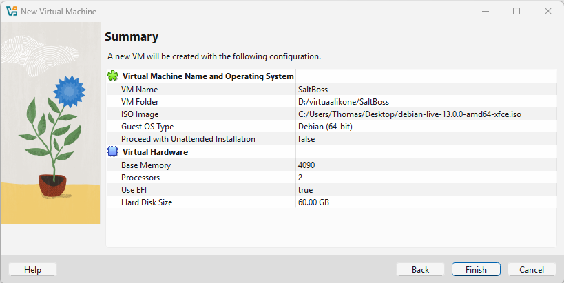  

## Saltin asennus

Aloitin asentamalla **wget**:in komennoilla `sudo apt-get update` ja `sudo apt-get install wget`. Wgetin avulla voidaan ladata tiedostoja verkosta (Gnu 2020).  

Ensin tarkastellaan että paketit tulevat oikeasti salt projektilta. Tein kansion saltrepo komennolla `mkdir saltrepo/` ja siirryin sinne komennolla `cd saltrepo/`. Tämän jälkeen latasin tiedostot Karvisen (2025) ohjeiden mukaan komennoilla:  
```
$ wget https://packages.broadcom.com/artifactory/api/security/keypair/SaltProjectKey/public
$ wget https://github.com/saltstack/salt-install-guide/releases/latest/download/salt.sources
```

Seuraavaksi käytin komentoa `less salt.sources` ja sain seuraavanlaisen sisällön komentoriville:  

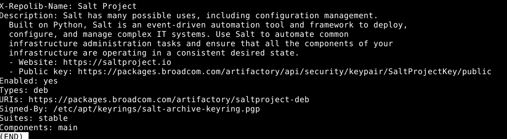  

Sisältö näyttäisi olevan virallisista lähteistä.  

Käytin komentoa `gpg --show-key --with-fingerprint public ` ja halusin tarkistaa, että fingerprint on oikea, mutta en löytänyt enään sivua mistä voisin tarkistaa onko avain oikea. Luotan tällä kertaa siihen, että se on, mutta tuotantoympäristössä tämä ei kävisi.  

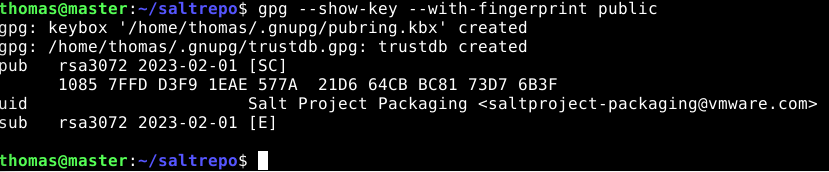  

Seuraavaksi lisäsin avaimen luotettuihin projekteihin komennoilla:  
```
$ sudo cp public /etc/apt/keyrings/salt-archive-keyring.pgp
$ sudo cp salt.sources /etc/apt/sources.list.d/
```
Tämän jälkeen asensin saltin komennoilla:  
```
$ sudo apt-get update
$ sudo apt-get install salt-minion salt-master
```
Ensimmäinen asennuksen yritys jumitti koneen täysin ja jouduin ottamaan virran kokonaan irti siitä. Tästä lähdetäänkin katsomaan kuinka edetään seuraavaksi. Hyödynsin ChatGPT:tä ja ajoin uudelleen käynnistämisen jälkeen komennon `sudo dpkg --configure -a` tämän pitäisi viimeiställä jumittunut asennus ja se näytti toimivan. Testasin asennusta komennolla `salt --version` ja voidaan huomata että toimii!  

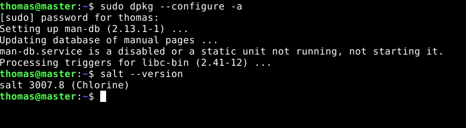  

Testasin vielä asennusta Karvisen (2025) ohjeella käyttämällä komentoa `sudo salt-call --local state.single file.managed /tmp/thomas
	file /tmp/hellothomas created` ja se näytti toimivan hyvin, eli tehtiin uusi file hellothomas, koska sitä ei ollut vielä olemassa.  

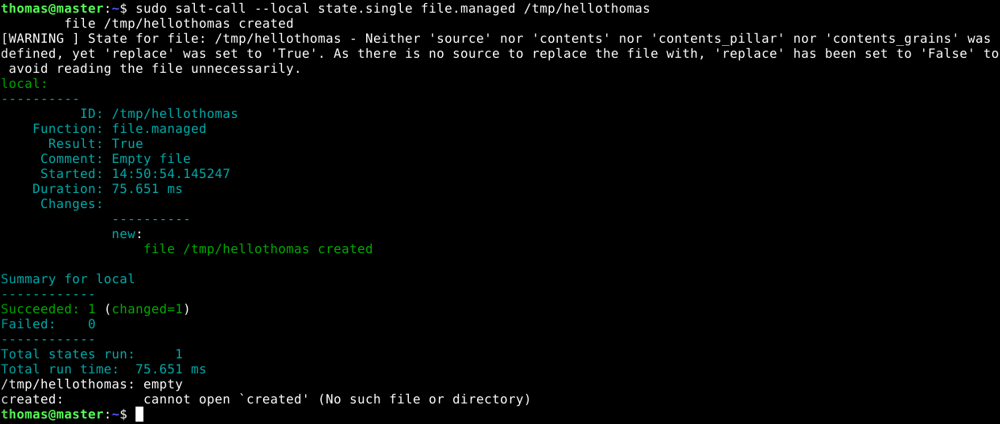 

Asennuksen yhteydessä koneelle on luotu salt-minion, jonka toiminta voidaan varmistaa komennolla `sudo systemctl status salt-minion`.  

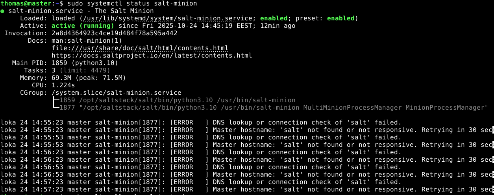  

Kuvasta voidaan huomata, että minion on toiminnassa. Error viestit johtuvat siitä ettei minion saa yhteyttä salt-masteriin.  

## Tärkeimmät state-funktiot (Karvinen 2021)

### pkg

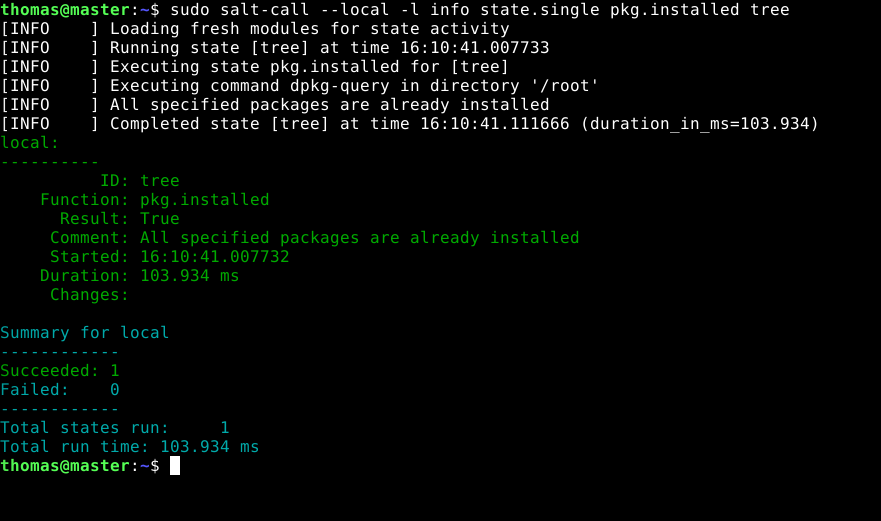  

Ajoin komennon `sudo salt-call --local -l info state.single pkg.installed tree` Info tekstistä voidaan heti huomata, että kaikki tähän liittyvät paketit ovat jo asennettu.  
1. ID on tree
2. Funktiona ajetaan pkg.installed, eli halutaan päästä tilaan missä tree-paketti on asennettu
3. Comment kertoo, että se on jo asennettu
4. Voidaan myös huomata aloitusaika ja funktion ajamisen kesto
5. Changes on tyhjä, koska muutoksia ei tehty
6. Succeeded on 1, jolloin funktio toimi kuten haluttiin

### file

`sudo salt-call --local -l info state.single file.managed /tmp/thomas contents="foo"`  

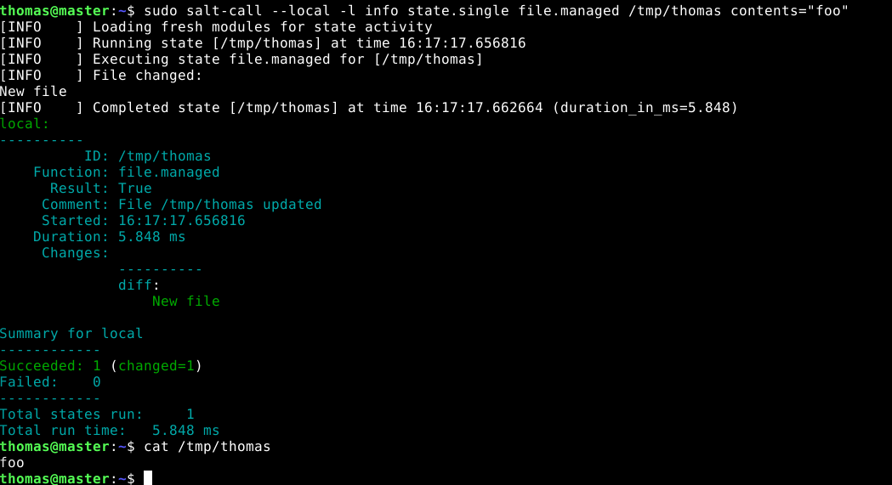  

Tällä komennolla haluttiin päästä tilaan, missä on olemassa tiedosto thomas, jonka sisältö on foo.  
1. ID, funktio ja result ovat samaan tapaan kuin edellisessä.
2. Kommenttiin ilmestyi File /tmp/thomas updated, eli tämä luotiin koska sitä ei ollut
3. Changes kertoo myös tiedoston luomisesta New file
4. Succeeded 1 ja nyt erona pkg:en voidaan huomata changed 1
5. cat /tmpt/thomas varmistettiin, että tiedosto luotiin ja sen sisältö on se mitä haluttiin  

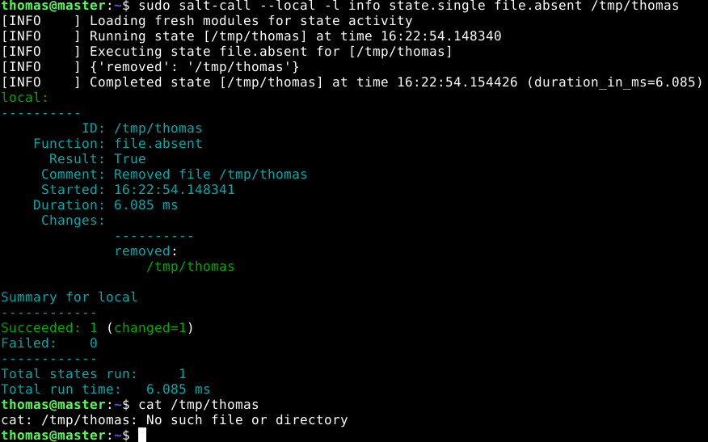  

Tässä poistettiin kyseinen tiedosto file.absent funktiolla. Cat:illa varmistettiin, että tiedostoa ei ole enään.  

### service

`sudo salt-call --local -l info state.single service.running ufw enable=True`  

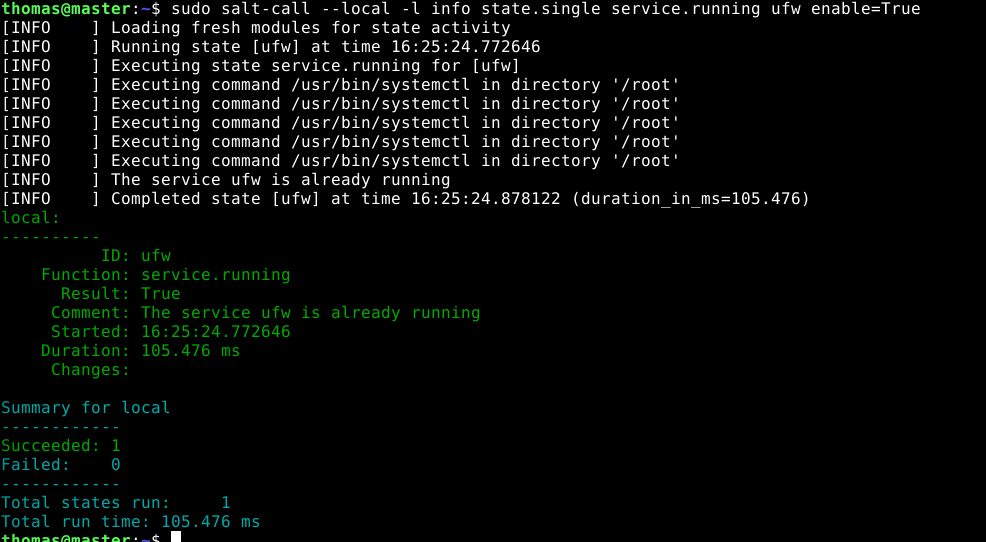  

Tällä funktiolla nähdään on daemon halutussa tilassa, eli oma komentoni katsoo onko palomuuri ylhäällä. Tässä tilanteessa palomuuri on ylhäällä, joten ei tehty muutoksia. Tämä voidaan huomata helpoiten Comment-osiosta. Tuo komento myös käynnistäisi palomuurin, jos se olisi ollut pois päältä.  

### user

`sudo salt-call --local -l info state.single user.present thomas2` ja `sudo salt-call --local -l info state.single user.absent thomas2`  

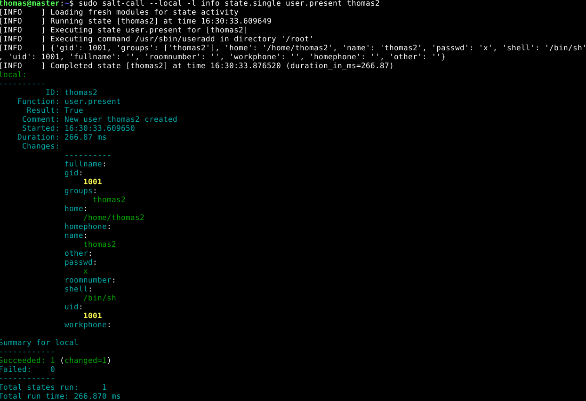  

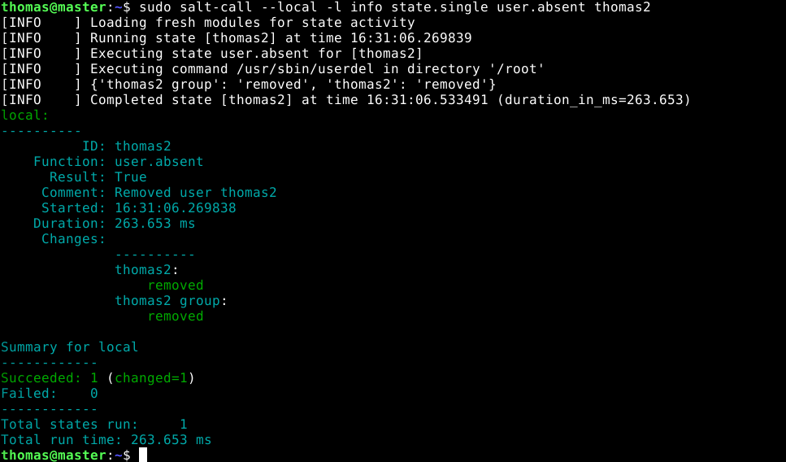  

Näillä komennoilla haluttiin päästä tilaan, missä käyttäjä thomas2 löytyy järjestelmästä ja tämän jälkeen tilaan, missä thomas2 ei ole järjestelmässä.  
1. Haluttu tila saavutettiin onnistuneesti
2. Luotiin käyttäjä, koska sitä ei ollut vielä
3. Käyttäjälle lisättiin myös kotihakemisto
4. Käyttäjä lisättiin omaan ryhmään
5. Tämän jälkeen ajoin user.absent-komennon
6. Kommenteista voidaan huomata, että käyttäjä thomas2 on poistettu
7. Changes kohdassa mainitaan thomas2 removed ja thomas2 group removed

### cmd

`sudo salt-call --local -l info state.single cmd.run 'touch /tmp/foo' creates="/tmp/foo"`  

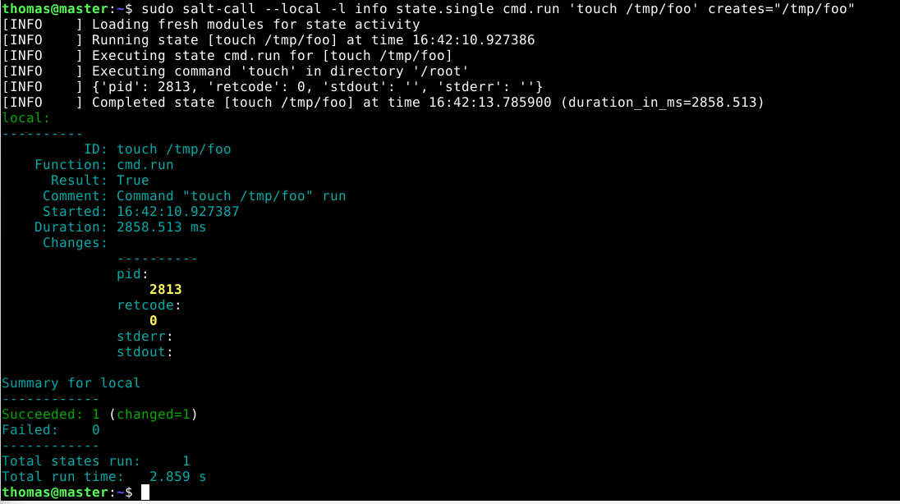  

1. Cmd.run ajaa komentorivikäskyn shellissä
2. Touch /tmp/foo suoritetaan, eli luodaan tiedosto jos sitä ei ole vielä olemassa
3. Creates="/tmp/foo" ajaa komennon vain jos tuota tiedostoa ei ole vielä olemassa
4. Ilman tuota ehtoa Salt ajaisi komennon jokakerta. Tämä johtuu siitä, että cmd.run ei ole tietoinen Saltin tilasta, eli se vain ajaa sitä uudestaan ja uudestaan, jos ehtoa ei lisätä komentoon. (saltstack)


## Idempotentti

Idempotentti tuottaa saman tuloksen, vaikka toiminto suoritettaisiin monta kertaa. Siinä määritetään siis tila mihin halutaan päästä ja jokainen suoritus tarkistaa ollaanko halutussa tilassa ja muuttaa sitä JOS EI olla halutussa tilassa.  

`sudo salt-call --local -l info state.single pkg.installed cowsay` tällä komennolla halutaan päästä tilaan, missä cowsay-paketti on asennettuna. `pkg.installed` on Saltin tila, joka varmistaa, että paketti on asennettu järjestelmään. Tuo komento tarkistaa onko cowsay asennettu. Jos se on funktio ei tee mitään, mutta jos se puuttuu, niin Salt asentaa sen ja lopuksi antaa raportin mitä tehtiin.  

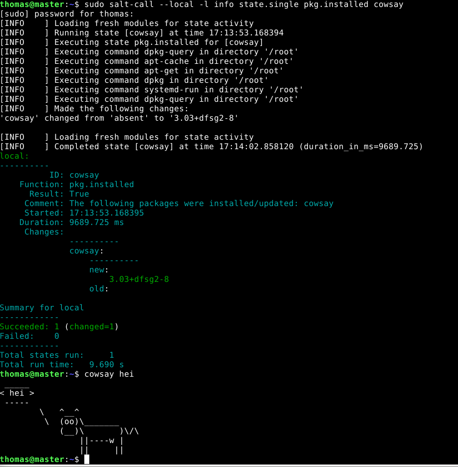  

Kun komento ajetaan uudestaan, huomataan että Salt ei tee muutoksia mihinkään. Komennon suoritus onnistui ja raportista näkee, että se oli jo asennettuna.  

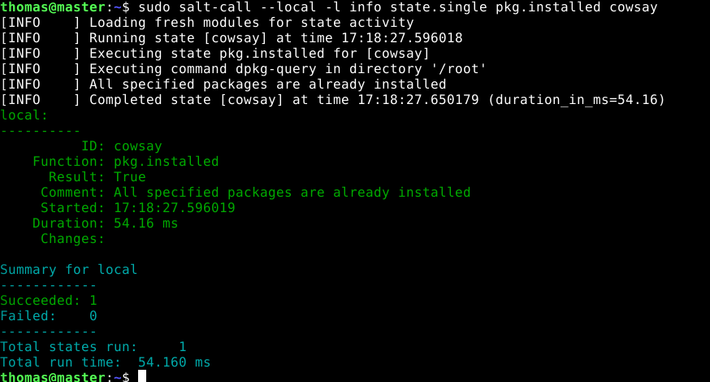  

Seuraavaksi ajoin komennon `sudo salt-call --local -l info state.single pkg.removed cowsay` kaksi kertaa, jolloin haluttu tila on cowsay-ohjelman puuttuminen järjestelmästä. Ensimmäisen kerran Salt poistaa ohjelman ja toisella kerralla Salt ei tee mitään, koska järjestelmä on halutussa tilassa.  

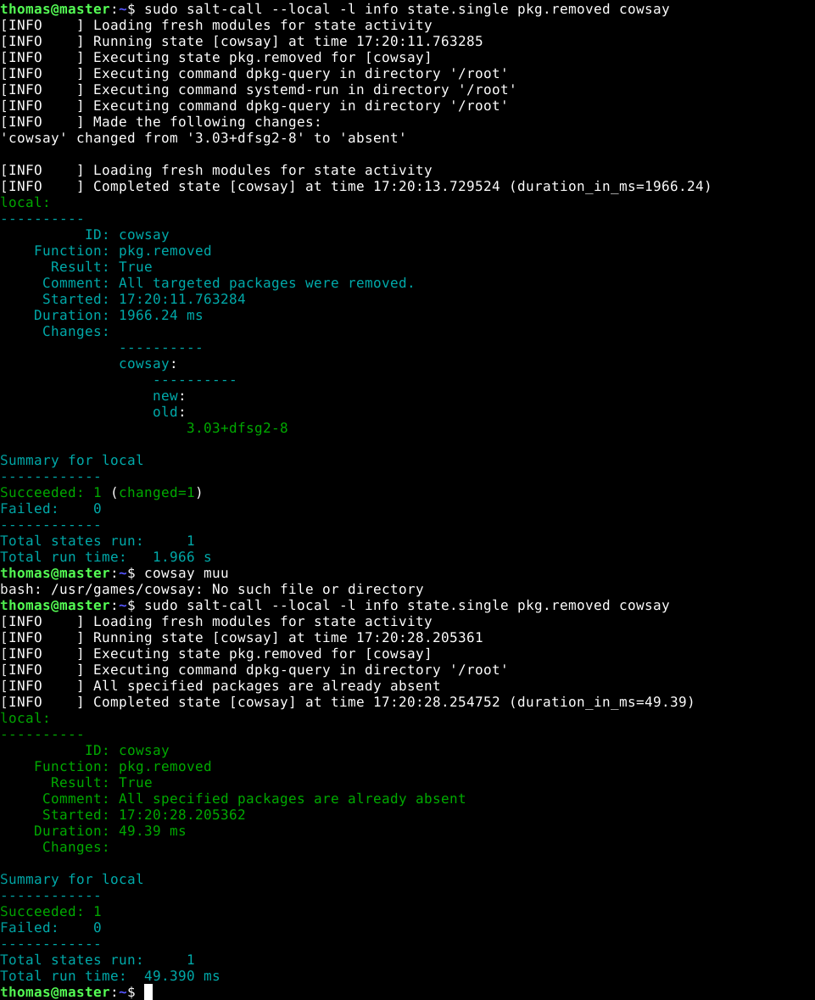  


## Lähteet
GNU. 2020. GNU wget. Luettavissa: https://www.gnu.org/software/wget/. Luettu: 24.10.2025  

Ifloadfocus. Mikä on Idempotenssi. Luettavissa: https://loadfocus.com/fi-fi/glossary/what-is-idempotency. Luettu: 24.10.2025  

Karvinen, T. 2025. Palvelinten Hallinta. Luettavissa: https://terokarvinen.com/palvelinten-hallinta/. Luettu: 22.10.2025  

Karvinen, T. 2025. Install Salt on Debian 13 Trixie. Luettavissa: https://terokarvinen.com/install-salt-on-debian-13-trixie/. Luettu: 22.10.2025  

Karvinen, T. 2021. Run Salt Command Locally. Luettavissa: https://terokarvinen.com/2021/salt-run-command-locally/. Luettu: 22.10.2025  

Karvinen, T. 2021. Install Debian on Virtualbox - Updated 2024. Luettavissa: https://terokarvinen.com/2021/install-debian-on-virtualbox/. Luettu: 23.10.2025  

Karvinen, T. 2018. Salt Quickstart – Salt Stack Master and Slave on Ubuntu Linux. Luettavissa: https://terokarvinen.com/2018/03/28/salt-quickstart-salt-stack-master-and-slave-on-ubuntu-linux/. Luettu: 22.10.2025  

Karvinen, T. 2006. Raportin kirjoittaminen. Luettavissa: https://terokarvinen.com/2006/06/04/raportin-kirjoittaminen-4/. Luettu: 22.10.2025  

Saltstack. salt.states.cmd. Luettavissa: https://salt-zh.readthedocs.io/en/latest/ref/states/all/salt.states.cmd.html. Luettu: 24.10.2025  


