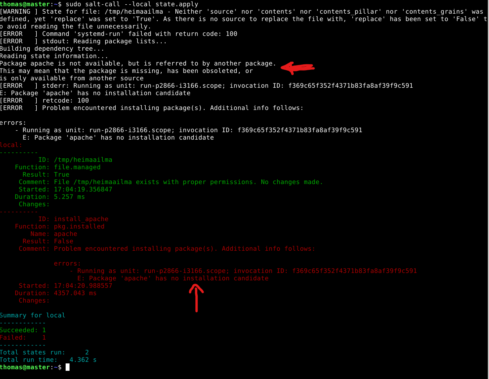

update: 29.10.2025  

# Lokaali tietokone ja käyttöjärjestelmä
**GPU:** Nvidia RTX 2070  
**Processor:** Intel Core i9-9900K 3.60 Ghz    
**RAM:** 16.0 GB  
**OS:**  Windows 11 Home  

# Virtuaali palvelin
**Template:** Debian GNU/Linux 13 (Trixie)  
**CPU:** 2 core  
**Storage:** 60 GB  

# Infrastructure as code

## Tiivistelmä

Tämän raportin tavoitteet löytyvät Karvisen (2025) Palvelinten hallinta verkkosivulta kohdasta H2. Tehtävän tekeminen sujui hyvin ja aikaa kului yhteensä noin 4 tuntia. Haasteita ja ongelmia tuli matkalla, mutta selvisin hyvin niistä. Tämä tehtävä haastoi mukavasti itseäni ja oli hienoa päästä testaamaan lopussa hieman laajemman konfiguraation tekemistä.  

## Lue ja tiivistä artikkelit

### Hello Salt Infra-as-Code

Ennen itse koodin kirjoittamista luodaan kansio /srv/ hakemistoon. `sudo mkdir -p /srv/salt/[moduulin nimi]`. Moduulin kannattaa nimetä kuvaavasti, esimerkiksi Apachen verkkopalvelinta varten nimi voisi olla `apache2`. (Karvinen 2024)  

Hakemisto /srv/salt/ on se kansio mikä jaetaan orjan koneille master koneelta ja tuosta hakemistosta löytyvä moduuli (esim apache2) sisältää kaikki Apacheen liittyvät koodit, tiedostot ja templatet. Moduulista löytyvä init.sls tiedosto toimii pääsisäänkäyntinä, eli se on ensimmäinen tiedosto joka ajetaan moduulin suorittamisen yhteydessä. (Karvinen 2024)  

Init.sls-tiedostolle voidaan antaa seuraavanlainen sisältö:  
```
/tmp/hellothomas:
  file.managed
```
Eli tässä Saltille annetaan ohjeeksi käsitellä tiedostoa `hellothomas`, joka sijaitsee /tmp/-hakemistossa. Saltin state-funktio file.managed pitää huolen, että haluttu tiedosto on olemassa. Koodiin voisi lisätä vielä lisärivin `- contents: "[sisältö tiedostoon]`, jolloin Salt varmistaisi, että tiedosto hellothomas on /tmp/-hakemistossa ja sen sisältö olisi määritellyn kaltainen. (Karvinen 2024)  

Kun moduuli on luotu, sitä voidaan ajaa lokaalisti komennolla `sudo salt-call --local state.apply [moduulin nimi]`. Tämä tulostaa komentoriville tulosteen, mistä näkee Saltin tekemät mahdolliset muutokset. Lopuksi on hyvä tarkistaa vielä eri työkalulla, että koodimme toimi halutulla tavalla, esimerkiksi `ls /tmp/hellothomas`. (Karvinen 2024)  

### Salt overview YAML

YAML on merkintäkieli. YAML renderöijä muuttaa YAML-datarakenteen Pythonin tietorakenteeksi, jota Salt käsittelee (Salt).  

Perussäännöt:  
1. Data muodostuu **avain**:**arvo** -pareista
2. Ne erotetaan kaksoipisteellä (:) ja yhdellä välilyönnillä
3. Avaimen arvo voi olla tyypiltää esimerkiksi teksti, numero, lista tai sanakirja
4. Avaimet ovat case-sensitive
5. Käytä välilyöntejä, ei tabulaattoria
6. Kommentti alkaa #

YAML kolme peruselementtiä:  

1. Scalars - avain-arvo-parit.  
```
eläin: kissa
hedelmä: omena
```

2. Lista, eli avaimen jälkeen tulee luettelo arvoista. Arvot alkavat yhdysmerkillä (-).  
```
eläin:
  - kissa
  - koira
  - leijona

hedelmä:
  - omena
  - mandariini
```

3. Sanakirja, eli kokoelma avain-arvo-pareja ja listoja.  
```
Päivällinen:
  alkupala: salaatti
  juoma: vesi
  pääruoka:
    - pihvi
    - muusi
    - kastike
  jälkiruoka:
    - suklaakakku
```  
(Salt YAML)  

### Top file

Top-filen avulla voidaan esimerkiksi ajaa uudet konfiguraatiot käyttöön kaikille minion koneille. Konfiguraatiot voidaan määrittää esimerkiksi ryhmien mukaan, esimerkiksi kaikki minionit joiden nimi alkaa sanalla "web" suorittavat apache.sls state-filen. (Topfile 2025)    
```
base:         # oletusympäristö
  'web*':     # kaikki minionit, joiden id alkaa merkkijonolla 'web'
    - apache  # ajetaan tilatiedosto apache.sls
```

## Tehtävät

### Hei maailma!

Aloitin tehtävän tekemisen siirtymällä hakemistossa polkuun -> /srv/salt/. Loin kyseiseen hakemistoon uuden kansion komennolla `sudo mkdir hello`, tämän jälkeen siirryin hello-kansioon ja loin uuden init.sls-tiedoston komennolla `sudoedit init.sls`.  

Annoin init.sls-tiedostolle seuraavanlaisen sisällön:  
```
/tmp/heimaailma:
  file.managed
```  

  

Ajoin komennon `sudo salt-call --local state.apply hello` ja huomasin, että en antanut helloworld-tiedostolle .sls loppua, joten komento ei toiminut. Korjasin asian uudelleen nimeämällä tiedoston komennolla `sudo mv helloworld helloworld.sls`. Taas ongelma kun yritin ajaa sudo salt-call -komentoa. Unohdin, että tiedoston pitää olla init.sls, joten seuraavaksi korjasin sen. Tämän jälkeen komento toimi halutulla tavalla. Tarkistin vielä, että Salt teki mitä halusin ajamalla komennon `ls /tmp/` ja siellä on uusi tiedostoni!  


(Karvinen 2024)  

### Topping

Siirryin hakemistossa kohtaan /srv/salt/ ja loin uuden tiedoston komennolla `sudoedit top.sls`. Halusin ajaa top-file:ssa äsken luomani hello:n ja Apachen asennuksen, joten annoin seuraavanlaisen sisällön top-filelle:  

```
base:
  '*':
    - hello
    - apache
```

Tämän jälkeen ajoin uuden top-file komennolla `sudo salt-call --local state.apply` ja kuten osasin odottaa sain virheilmoituksen.  

  

Eli apacheen liittyvää sls-tiedostoa ei löydy, kuten osasin odottaa. Seuraavaksi loin apachea varten uuden moduulin hakemistoon /srv/salt/apache. Loin apache-kansiooni init.sls-tiedoston seuraavalla sisällöllä:  

```
install_apache:
  pkg.installed:
    - name: apache
```

Ajoin state.apply komennon uudestaan ja sain seuraavanalaisen virheilmoituksen:  

  

Oletan, että apachen moduulista löytyvää init.sls-tiedostoa pitää muokata jotenkin. Ensimmäinen korjaus jota yritän on muuttaa -name: apache -> -name: apache2. Virheilmoitus sanoo selkeästi, että apache nimistä pakettia ei ole olemassa pakettivarastossani.  

Ajoin state.apply:n uudestaan ja kuten arvasin, apachen asennus toimi tällä kertaa oikein hyvin.  

  

  

Kysymys: ajaako salt myös sudo apt-get updaten automaattisesti ennenkuin asentaa Apache2:n?  

### Viisikko tiedostossa

Loin aluksi kaikille tila-funktioille omat kansiot komennolla `sudo mkdir /srv/salt/hellopkg /srv/salt/hellofile /srv/salt/helloservice /srv/salt/hellouser /srv/salt/hellocmd`.  

  

#### pkg

  

#### file

  

#### service

  

#### user

  
(stackoverflow 2024)  

  

#### cmd

  
(salt.states.md)  

Tässä tehtävässä kannattaa huomioida, että init.sls tiedostolle on annettu creates-ominaisuus, eli komentoa ei ajeta, jos tiedosto löytyy jo.  

### sls-tiedosto

Lähdin tekemään apache_demo moduulia. Tarkoituksena on asentaa apachen web-serveri, muokata apachen-defaultsivua ja varmistetaan, että apache on käynnissä ja toimii.  

#### lähtötilanne

Lähtötilanteessa apache2 ei ole asennettu. Tämä on tarkistettu komennoilla `dpkg -l | grep apache2` ja `sudo systemctl status apache2`. Dpkg -komennolla voidaan tarkistaa asennetut paketit, -l listaa paketit ja grep:llä etsitään apache2 nimistä pakettia.  

  

#### sls-tiedoston konfiguraatio
(linode 2019)  

  

Kävin luomassa apache_demo -moduulin ja annoin kuvan mukaisen sisällön tiedostolle.  

1. pkg.installed asentaa apache2 webbi-serverin
2. file.managed muokkaa /var/www/html/ -polusta löytyvää apachen defaul-sivua ja antaa lyhyen HTML5 sivun sisällön sille (Karvinen 2012)
3. service.running varmistaa, että apache2 on päällä
4. lisäsin myös create_index ja apache_service kohtiin required-rivit, eli Salt asentaa ne halutussa järjestyksessä

#### lopputulos

Lähdin kokeilemaan moduuliani komennolla `sudo salt-call --local state.apply apache_demo`. Täytyy myöntää, että ennen ensimmäistä ajoa jännitti hieman.  

  

Ensimmäinen virhe viittaa HTML -koodiin, eli siinä näyttäisi olevan jotain vikaa. Pitkän sisennyksien tarkistelun jälkeen lähdin kokeilemaan Linoden ohjeesta löytyvää tapaa, eli tein apache_demo kansioon index.html tiedoston mihin laitoin HTML-koodin. Tämän jälkeen muokkasin init.sls tiedostoa viittaamaan tuohon index.html-tiedostoon. Tässä viimeisin versio init.sls:stä ennen kokeilua:  

  

Nyt komento toimi halutulla tavalla. Eli apache asennettiin, sivua muokattiin ja varmistettiin, että demoni toimii.  

  

  

  

Seuraavaksi testataan miltä etusivu näyttää nyt. 

  

Hienosti näyttää toimivan!

  

State.apply ajettiin uudestaan ja muutoksia ei tehty. Moduuli on siis idempotentti.  

  

## Lähteet

Karvinen, T. 2025. Palvelinten hallinta. Luettavissa: https://terokarvinen.com/palvelinten-hallinta/#h2-infraa-koodina. Luettu: 29.10.2025  

Karvinen, T. 2024. Hello Salt Infra-as-Code. Luettavissa: https://terokarvinen.com/2024/hello-salt-infra-as-code/. Luettu: 29.10.2025  

Karvinen, T. 2012. Short HTML5 page. Luettavissa: https://terokarvinen.com/2012/short-html5-page/. Luettu: 31.10.2025  

Linode. 2019. Configure Apache with Salt Stack. Luettavissa: https://www.linode.com/docs/guides/configure-apache-with-salt-stack/. Luettu: 31.10.2025  

Saltproject. Salt overview YAML. Luettavissa: https://docs.saltproject.io/salt/user-guide/en/latest/topics/overview.html#rules-of-yaml. Luettu: 29.10.2025  

Saltproject. salt.states.cmd. Luettavissa: https://docs.saltproject.io/en/3007/ref/states/all/salt.states.cmd.html. Luettu: 31.10.2025  

Saltproject. 2025. THE TOP FILE. Luettavissa: https://docs.saltproject.io/en/latest/ref/states/top.html. Luettu: 29.10.2025  
Stackoverflow. 2024. Check Whether a User Exists. Luettavissa: https://stackoverflow.com/questions/14810684/check-whether-a-user-exists. Luettu: 31.10.2025  


