update: 7.11.2025  

# Lokaali tietokone ja käyttöjärjestelmä
**GPU:** Nvidia RTX 2070  
**Processor:** Intel Core i9-9900K 3.60 Ghz    
**RAM:** 16.0 GB  
**OS:**  Windows 11 Home  

# Virtuaali palvelin
**Template:** Debian GNU/Linux 13 (Trixie)  
**CPU:** 2 core  
**Storage:** 60 GB  

# Infrastructure as code

## Tiivistelmä

Tämän raportin tavoitteet löytyvät Karvisen (2025) Palvelinten hallinta verkkosivulta kohdasta H3.   

## Lue ja tiivistä artikkelit

### Kahden koneen virtuaalinen verkko

Vagrantin avulla voidaan luoda helposti uusia virtuaalikoneita ilman graafista käyttöliittymää. Koneille kirjaudutaan SSH-yhteydellä. Debianissa Vagrant ja Virtualbox asennetaan komennolla `sudo apt-get install vagrant virtualbox` ja Vagrant ohjaa Virtualboxia tässä tapauksessa. (Karvinen 2021)  

Asennuksen jälkeen luodaan uusi kansio projektille komennolla `mkdir twohost/` ja tänne kansioon luodaan Vagrantfile, johon annetaan ohjeet virtuaalikoneiden asennukseen. (Karvinen 2021)  

Koneet käynnnistetään komennolla `vagrant up` ja kirjautuminen sisään tapahtuu komennolla `vagrant ssh [koneen nimi]`. `vagrant exit` kirjautuu koneelta ulos ja `vagrant destroy` tuhoaa virtuaalikoneet. Kun koneet on käynnistetty, on hyvä tarkistaa, että ne voivat pingata toisiaan ja ovat yhteydessä internettiin. (Karvinen 2021)  

### Salt Quickstart

Tämä artikkeli on käyty läpi jo aikaisemmassa tehtävässä h1 viisikko. Kopioin aikaisemmin kirjoittamani tekstin tähän alle:  

Kuinka Saltilla siis hallitaan useita koneita? Useiden koneiden hallintaan tarvitaan yksi Master-palvelin, joka ohjaa muita Slave-koneita. Hienous piileekin siinä, että vain Master tarvitsee julkisen IP-osoitteen, Slavet (minionit) voivat olla missä tahansa, koska yhteys toimii NAT:in ja palomuurien läpi.  

Master-palvelimen palomuuriin tulisi puhkaista reikä porteille 4505/tcp ja 4506/tcp, jotta yhteys toimii. Käytännössä Salt Master asennetaan yhdelle koneelle ja tämän jälkeen Salt Minion asennetaan ohjattaville koneille. Minion-koneille kerrotaan myös missä IP-osoitteessa Master sijaitsee. Tämän jälkeen minion-daemonia potkaistaan ja Master hyväksyy Minionin-avaimen, jolloin yhteys on valmis käyttöön. (Karvinen 2018)  

### Salt Vagrant

Infra as Code, eli meidän tapauksessa: kirjoitetaan tekstitiedostoon koodi, mikä kertoo, minkälaisia virtuaalikoneita haluamme pystyttää ja millä asetuksilla. Top-fileen voidaan määrittää mitkä tilat ajetaan komennolla `sudo salt '*' state.apply`, eli ei tarvitse kirjoittaa jokaista moduulia erikseen, mitkä sijaitsevat top.sls -tiedostossa. (Karvinen 2023)  

## Tehtävät

### Hello Vagrant!

Aloitin tehtävän etsimällä tietoa kuinka saan asennettua Vagrantin Windowsille. Löysin Vagrantin viralliselta sivulta ladattavan tiedoston, eli valitaan täältä: https://developer.hashicorp.com/vagrant/downloads -> Windows Binary download -> AMD64. 

Tiedoston lataamisen jälkeen avasin installerin. Asennus oli erittäin yksinkertainen ja se ei tarjonnut mitään valintoja asennukseen. Asennuksen jälkeen oli aika käynnistää järjestelmä uudelleen.  

Uudelleen käynnistyksen jälkeen avasin host-koneellani (Windows) command promptin ja annoin komennon `vagrant --version`. Komento toimi, eli vagrant on asennettu.  

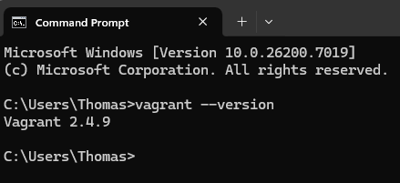  

Olin asentanut Oraclen Virtual Boxin aikaisemmin, joten en käy sen asennusta tässä läpi.  

### Linux Vagrant

Seuraavaksi on aika asentaa uusi virtuaalikone Vagrantilla. Aloitin Karvisen (2025) ohjeista löytyvällä komennolla vagrant init debian/trixie13`. Vaihdoin komennosta osan bookworm64 -> trixie13. 

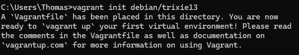  

Tämän jälkeen ajoin komennon `vagrant up` ja sain seuraavanlaisen virheilmoituksen:  

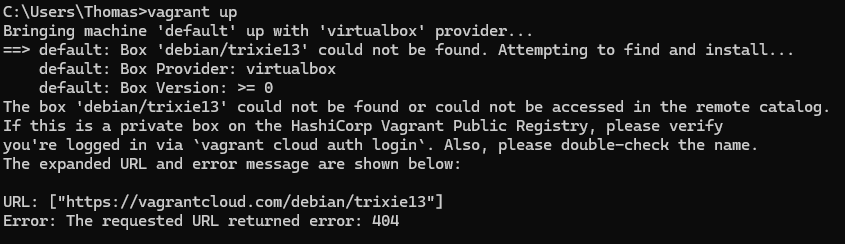  

Tämä viittaisi siihen että Trixie13 ei löydy Vagrantilla. Kokeillaan seuraavaksi Karvisen ohjeiden mukaan bookworm64.  

Päätin aluksi luoda virtuaalikoneelleni uuden kansion polkuun `C:\users\thomas\debian` siirryin hakemistoon komennolla `cd debian`. Nyt kokeilen virtuaalikoneen asennusta uudeelleen.  

`vagrant init debian/bookworm64`  

`vagrant up`

Asennus onnistui ja huomasin, että Virtualboxiin ilmestyi uusi kone, joka on käynnissä.  

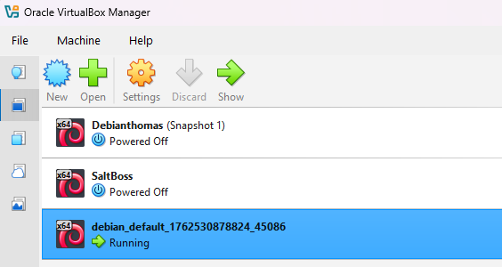  

Seuraavaksi otetaan SSH-yhteys koneeseen host koneeni command promptista komennolla `vagrant ssh`. 

Ja sisällä ollaan! Testasin, että netti toimii komennolla `ping 8.8.8.8` ja tarkistin koneen IP-osoitteen komennolla `hostname -I`. Kaikki näyttää toimivan hyvin.  

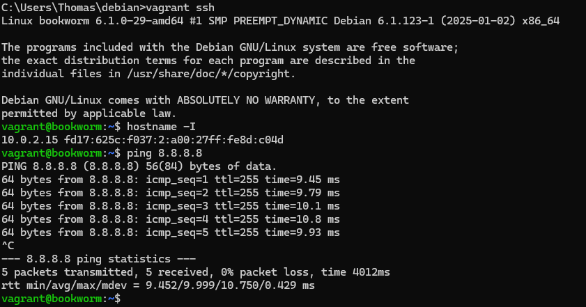  

Tämän jälkeen virtuaalikoneesta exit ja komento `vagrant destroy`.  

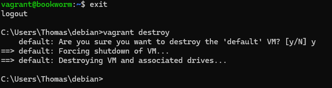  

Koneen tuhoamisen jälkeen tarkistin vielä Virtuaboxista, että kone oli kadonnut.  

## Kaksi konetta

Tässä tehtävässä aion luoda kaksi uutta virtuaalikonetta, joista toinen toimii masterina ja toinen minionina.  

Aloitin antamalla komennon `vagrant init debian/bookworm64` host-koneellani. Initin jälkeen avasin vagrantfile:n notepadissa komennolla `notepad.exe Vagrantfile` (Reddit 2023). Tämän jälkeen siirryin muokkaamaan tiedostoa.  

Vagrant -tiedosto:  
```
# -*- mode: ruby -*-
# vi: set ft=ruby :

$master = <<MASTER
sudo apt-get update
sudo apt-get -y install curl # -y vastaa oletuskysymyksiin YES

sudo mkdir -p /etc/apt/keyrings
curl -fsSL https://packages.broadcom.com/artifactory/api/security/keypair/SaltProjectKey/public | sudo tee /etc/apt/keyrings/salt-archive-keyring.pgp
curl -fsSL https://github.com/saltstack/salt-install-guide/releases/latest/download/salt.sources | sudo tee /etc/apt/sources.list.d/salt.sources

sudo apt-get update
sudo apt-get -y install salt-master

echo "Master installed"
MASTER


$minion = <<MINION
sudo apt-get update
sudo apt-get -y install curl

sudo mkdir -p /etc/apt/keyrings
curl -fsSL https://packages.broadcom.com/artifactory/api/security/keypair/SaltProjectKey/public | sudo tee /etc/apt/keyrings/salt-archive-keyring.pgp
curl -fsSL https://github.com/saltstack/salt-install-guide/releases/latest/download/salt.sources | sudo tee /etc/apt/sources.list.d/salt.sources

sudo apt-get update
sudo apt-get -y install salt-minion


echo "master: 192.168.88.100" | sudo tee /etc/salt/minion # laitetaan masterin IP-osoite minionille

sudo systemctl stop salt-minion
sudo systemctl start salt-minion # käytin tässä kohtaa starttia ja stoppia, koska tunnilla ilmeni ongelmia restartin kanssa

echo "Minion installed"
MINION

Vagrant.configure("2") do |config|
	config.vm.synced_folder ".", "/vagrant", disabled: true
	config.vm.synced_folder "shared/", "/home/vagrant/shared", create: true
	config.vm.box = "debian/bookworm64"

	config.vm.define "master" do |master|
		master.vm.hostname = "master"
		master.vm.network "private_network", ip: "192.168.88.100"
		master.vm.provision "shell", inline: $master
	end

	config.vm.define "minion", primary: true do |minion|
		minion.vm.hostname = "minion"
		minion.vm.network "private_network", ip: "192.168.88.101"
		minion.vm.provision "shell", inline: $minion
	end
	
end
```  

Käytin tämän tiedoston tekemisessä apuna Gianlexin (2025) tekemää harjoitusta, sekä Karvisen (2021) kahden virtuaalikoneen asennus ohjetta. Pyysin myös ChatGPT:tä tarkistamaan skriptin mahdolliset kirjoitusvirheet.  

Eli luomani skripti luo kaksi Debian 12 (Bookworm64) virtuaalikonetta Master ja Minion.  

Määritin aluksi kaksi skriptiä, jotka päivittävät pakettiluettelot ja asentavat Curl -työkalun.  

Molemmille asennetaan Saltin paketit aikaisemmista tehtävistä tutulla tavalla.  

Salt käynnistetään uudelleen stop/start menetelmällä, koska restart aiheutti ongelmia tunnilla.  

Master saa IP-osoitteen 192.168.88.100 ja Minion IP-osoitteen 192.168.88.101. Skripti myös kirjoittaa Minionille Masterin IP-osoitteen salt-minionin konfiguraatio tiedostoon.  

Lähdetään kokeilemaan asennusta komennolla `vagrant up`. Ongelmia asennuksen aikana ei ilmennyt ja Virtualboxiin on ilmestynyt kaksi uutta konetta.  

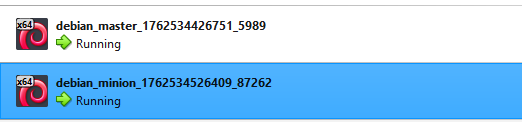  

Otetaan ensin yhteys masteriin komennolla `vagrant ssh master`. Kokeilin pingata minionia ja se onnistui.  

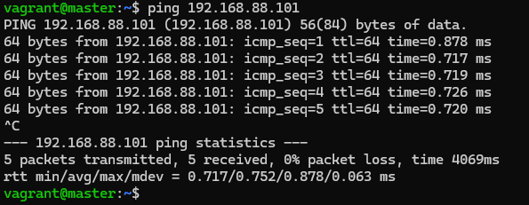  

Kokeilin myös, että minion voi pingata masteria ja näytti toimivan.  

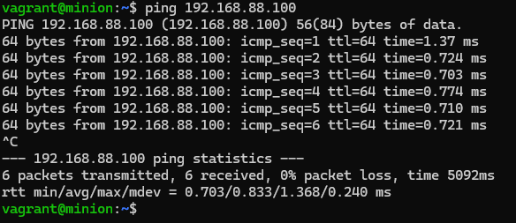  

### Herra-orja verkossa

Salt-master ja Salt-minion asennettiin koneille virtuaalikoneiden asennuksen yhteydessä. Seuraavaksi täytyy hyväksyä Minionin avain Masterilla. Käytetään komentoa `sudo salt-key`. Jostain syystä hyväksyttäviä avaimia ei näy. Kävin tarkistamassa että Minion-koneen /etc/salt/minion -tiedostosta löytyi masterin IP-osoite ja Tarkistin myös masterilta, että Salt-master on päällä. Pienen vianselvityksen jälkeen huomasin, että minion näkyykin **unaccepted keys** -kohdassa. Eli seuraavaksi komento `sudo salt-key -A`.  

Kokeilin minionin komentamista Karvisen (2018) ohjeesta löytyvällä komennolla `master$ sudo salt '*' cmd.run 'whoami'` ja sain seuraavanlaisen vastauksen:  

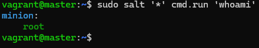  

Kaikki näyttää toimivan vielä odotetulla tavalla. Seuraavaksi laittaisin Vagrantfileen vielä skriptin, joka hyväksyisi avaimet suoraan.  

### Tilojen ajaminen verkon yli

Halusin asentaa molemmille koneille palomuurin Saltilla. Aloitin asentamalla myös Masterille Salt-minion -paketin. Tämän jälkeen Masterilla käydään muokkaamassa /etc/salt/minion -polkuun masterin IP-osoite ja potkaistaan demonia. Kokeilin ajaa komentoa `sudo salt '*' state.single pkg.installed ufw`.   

Tilojen ajaminen kaatoi Salt-masterin ja vika tuntui olevan muistin määrässä.  

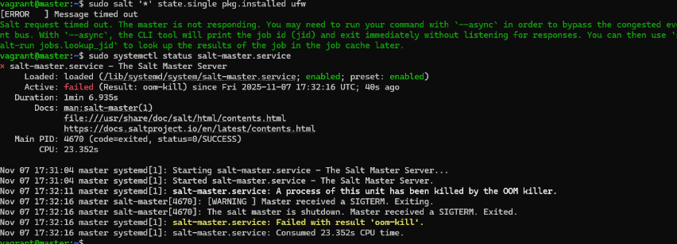  

Lisäsin siis virtuaalikoneiden muistia muokkaamalla Vagrant-tiedostoa. Tässä uusi versio:  

```
# -*- mode: ruby -*-
# vi: set ft=ruby :

$master = <<MASTER
sudo apt-get update
sudo apt-get -y install curl # -y vastaa oletuskysymyksiin YES

sudo mkdir -p /etc/apt/keyrings
curl -fsSL https://packages.broadcom.com/artifactory/api/security/keypair/SaltProjectKey/public | sudo tee /etc/apt/keyrings/salt-archive-keyring.pgp
curl -fsSL https://github.com/saltstack/salt-install-guide/releases/latest/download/salt.sources | sudo tee /etc/apt/sources.list.d/salt.sources

sudo apt-get update
sudo apt-get -y install salt-master

echo "Master installed"
MASTER


$minion = <<MINION
sudo apt-get update
sudo apt-get -y install curl

sudo mkdir -p /etc/apt/keyrings
curl -fsSL https://packages.broadcom.com/artifactory/api/security/keypair/SaltProjectKey/public | sudo tee /etc/apt/keyrings/salt-archive-keyring.pgp
curl -fsSL https://github.com/saltstack/salt-install-guide/releases/latest/download/salt.sources | sudo tee /etc/apt/sources.list.d/salt.sources

sudo apt-get update
sudo apt-get -y install salt-minion


echo "master: 192.168.88.100" | sudo tee /etc/salt/minion # laitetaan masterin IP-osoite minionille

sudo systemctl stop salt-minion
sudo systemctl start salt-minion # käytin tässä kohtaa starttia ja stoppia, koska tunnilla ilmeni ongelmia restartin kanssa

echo "Minion installed"
MINION

Vagrant.configure("2") do |config|
	config.vm.synced_folder ".", "/vagrant", disabled: true
	config.vm.synced_folder "shared/", "/home/vagrant/shared", create: true
	config.vm.box = "debian/bookworm64"

	config.vm.define "master" do |master|
		master.vm.hostname = "master"
		master.vm.network "private_network", ip: "192.168.88.100"
		master.vm.provider "virtualbox" do |vb|
     		vb.customize ["modifyvm", :id, "--memory", "2048"]
    	end
		master.vm.provision "shell", inline: $master
	end

	config.vm.define "minion", primary: true do |minion|
		minion.vm.hostname = "minion"
		minion.vm.network "private_network", ip: "192.168.88.101"
		minion.vm.provider "virtualbox" do |vb|
      		vb.customize ["modifyvm", :id, "--memory", "1024"]
    	end

		minion.vm.provision "shell", inline: $minion
	end
	
end
```

Masterin base memory nostettu -> 2048 MB ja Minionin -> 1024 MB. Tiedoston muutosten jälkeen ajoin komennon `vagrant reload --provision`, eli sammuttaa koneet -> lukee vagrant-tiedostoa uudelleen -> käynnistää koneen uusilla asetuksilla.  

Muutos toimi ja komennon `sudo salt '*' state.single pkg.installed ufw` ajaminen toimi.  

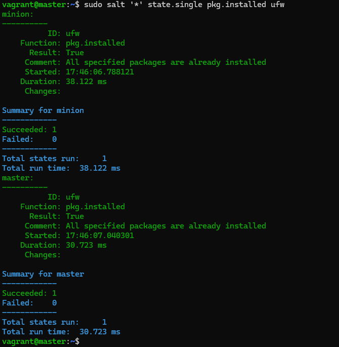  

Toinen komento mitä kokeilin oli `sudo salt '*' cmd.run 'sudo ss -tuln', eli tarkistetaan mitkä portit ovat auki palomuurissa. Komento antoi seuraavanlaisen tulosteen:  

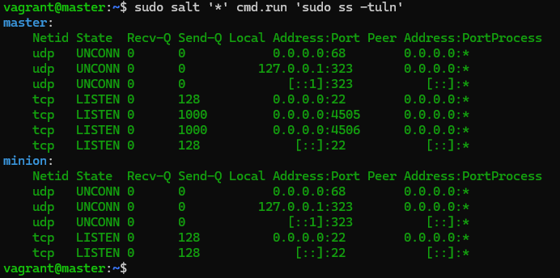  

Master kuuntelee portteja 22/tcp, 4505/tcp ja 4505/tcp.  

Minion kuuntelee porttia 22/tcp.  

Lopuksi ajoin host koneessani komennon `vagrant destroy`, jolloin luodut virtuaalikoneet tuhoutuivat.  


## Lähteet

Gianlex. 2025. H2 - Soitto kotiin. Luettavissa: https://github.com/gianglex/Courses/blob/main/Palvelinten-Hallinta/h2-soitto-kotiin.md. Luettu: 7.11.2025  

Hashicorp. 2025. Install Vagrant. Luettavissa: https://developer.hashicorp.com/vagrant/downloads. Luettu: 7.11.2025  

Karvinen, T. 2025. Palvelinten hallinta. Luettavissa: https://terokarvinen.com/palvelinten-hallinta/#h3-soitto-kotiin. Luettu: 7.11.2025  

Karvinen, T. 2023. Salt Vagrant - automatically provision one master and two slaves. Luettavissa: https://terokarvinen.com/2023/salt-vagrant/#infra-as-code---your-wishes-as-a-text-file. Luettu: 7.11.2025  

Karvinen, T. 2021. Two Machine Virtual Network With Debian 11 Bullseye and Vagrant. Luettavissa: https://terokarvinen.com/2021/two-machine-virtual-network-with-debian-11-bullseye-and-vagrant/. Luettu: 7.11.2025  

Karvinen, T. 2018. Salt Quickstart – Salt Stack Master and Slave on Ubuntu Linux. Luettavissa: https://terokarvinen.com/2018/salt-quickstart-salt-stack-master-and-slave-on-ubuntu-linux/?fromSearch=salt%20quickstart%20salt%20stack%20master%20and%20slave%20on%20ubuntu%20linux. Luettu: 7.11.2025  

Reddit. 2023. Open .txt file via cmd. Luettavissa: https://www.reddit.com/r/commandline/comments/1ago7sm/open_txt_file_via_cmd/. Luettu: 7.11.2025  


