update: 11.11.2025  

# Lokaali tietokone ja käyttöjärjestelmä
**GPU:** Nvidia RTX 2070  
**Processor:** Intel Core i9-9900K 3.60 Ghz    
**RAM:** 16.0 GB  
**OS:**  Windows 11 Home  

# Virtuaali palvelin
**Template:** Debian GNU/Linux 13 (Trixie)  
**CPU:** 2 core  
**Storage:** 60 GB  

# Pkg-file-service

## Tiivistelmä

Tämän raportin tavoitteet löytyvät Karvisen (2025) Palvelinten hallinta verkkosivulta kohdasta H4.

## Lue ja tiivistä artikkelit

Perinteinen lähestymistapa demonien hallintaan Saltilla:  
1. Asennetaan paketti #pkg.installed
2. Muokataan konfiguraatiota #file.managed
3. Potkaistaan demonia #service.running, lisätään myös watch:, joka varmistaa, että asetustiedoston muuttuessa demoni käynnistetään uudelleen
4. Ajetaan tilaa minioneille #sudo salt '*' state.apply [moduulin nimi]
(Karvinen 2018)

# Tehtävät

Päätin tehdä tehtävät ilman Vagranttia tällä kertaa, eli kirjaudun aiemmin luodulle virtuaalikoneelle ja kokeilen kaikki asetukset sillä.    

## SSHouto

### Käsintehty

Tarkistin aluksi onko SSH asennettu virtuaalikoneelle ja tyhjää näytti. Tämän jälkeen `sudo apt-get update` -> `sudo apt-get install ssh` -> sudo systemctl status ssh`.   

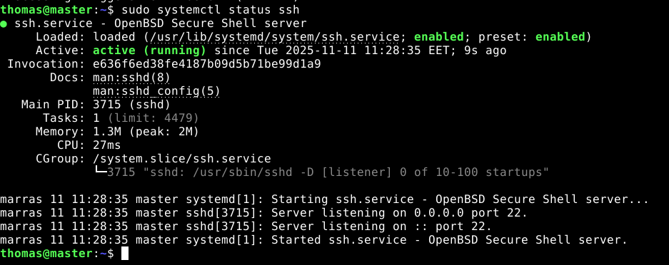  

Seuraavaksi siirryin hakemistossa kohtaan /etc/ssh/ ja avasin sshd_configin microssa komennolla `micro /etc/ssh/sshd_config`. Kävin muuttamassa asetustiedostoista päälle portit 8888 ja 22.  

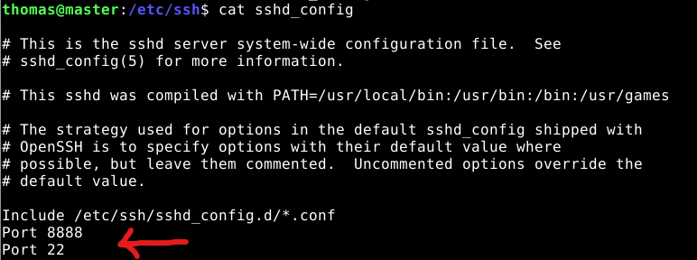  

Koska asetuksia muutettiin on syytä potkaista demonia eli `sudo systemctl restart ssh`.

Tämän jälkeen kirjauduin sisään omalle käyttäjälleni ssh yhteydellä, eli komento `ssh -p 8888 thomas@localhost` ja sisällä ollaan!  

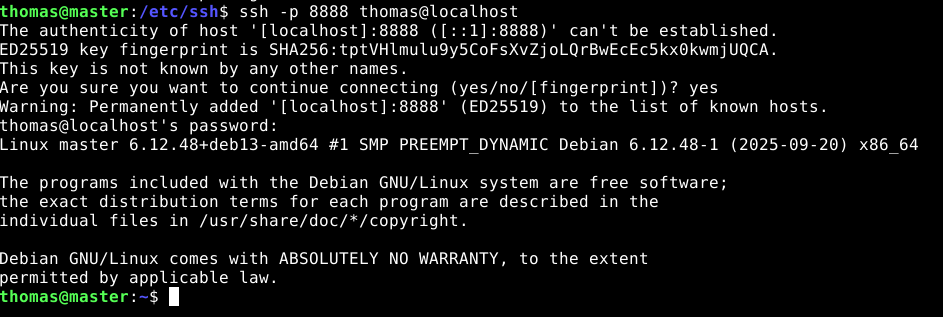  

Ennen asennuksen poistoa luon kansion ssh:lle polkuun /srv/salt/ ja kopioin muokkaamani sshd_config tiedoston sinne. `sudo mkdir -p /srv/salt/ssh` ja `sudo cp /etc/ssh/sshd_config /srv/salt/ssh/sshd_config`.  

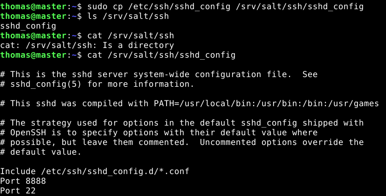  

Tämän jälkeen poistetaan äsken asennettu ssh palvelin komennolla `sudo apt remove --purge openssh-server -y`.  

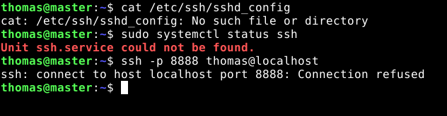  

### Automatisointi

Aloitetaan luomalla Salt-conf tiedosto aiemmin luotuun polkuun eli `sudoedit /srv/salt/ssh/init.sls` ja annetaan seuraava sisältö tiedostolle:  

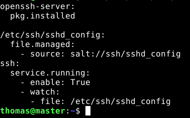  

Aika testata eli ajetaan `sudo salt '*' state.apply ssh` ja komento toimi mainiosti heti ekalla yrityksellä!  

   

Eli ssh-paketti asennettiin, /etc/ssh/sshd_config tiedostoa muutettiin ja demoni käynnistettiin uudelleen. Seuraavaksi testaillaan hieman toimivuutta.

### Testit

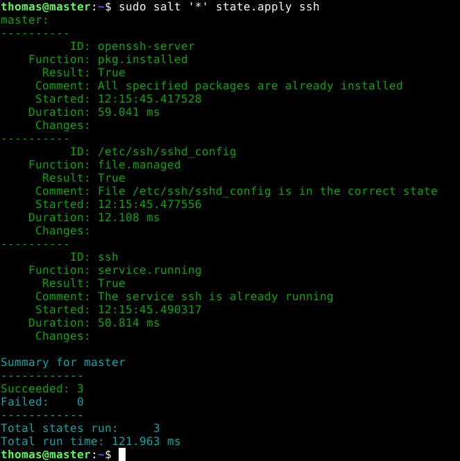

Toinen ajo ei tehnyt mitään muutoksia, eli se on idempotentti. Seuraavaksi kokeilin kirjautua käyttäjälleni ssh -yhteydellä, komennolla `ssh -p 8888 thomas@localhost` ja sain virheilmoituksen. 

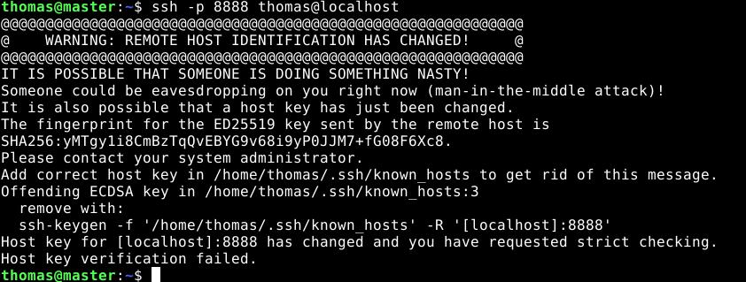  

Eli SSH-palvelimen avain on vaihtunut, koska poistin ssh-paketin ja asensin sen uudelleen. Korjataan antamalla komento `ssh-keygen -f "/home/thomas/.ssh/known_hosts" -R '[localhost]:8888'`. Tämän jälkeen sisäänkirjautuminen onnistui.  

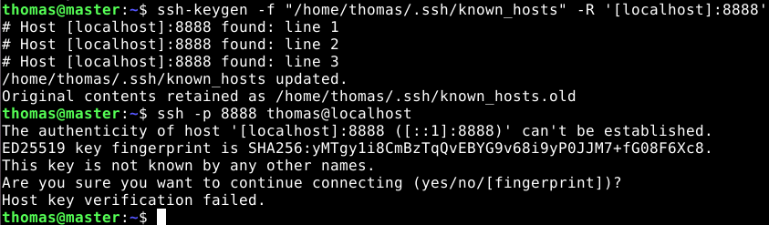  

Tämän voisi todennäköisesti automatisoida Saltilla, mutta en ajan säästämiseksi lähde paneutumaan siihen enemää. Seuraavaksi muutan /etc/ssh/sshd_config -tiedostoa käsin ja katson mitä Salt tekee.  

  

Kävin kommentoimassa port 8888 muutoksen pois tiedostosta. Tämän jälkeen ajetaan uudestaan `sudo salt '*' state.apply ssh`.  

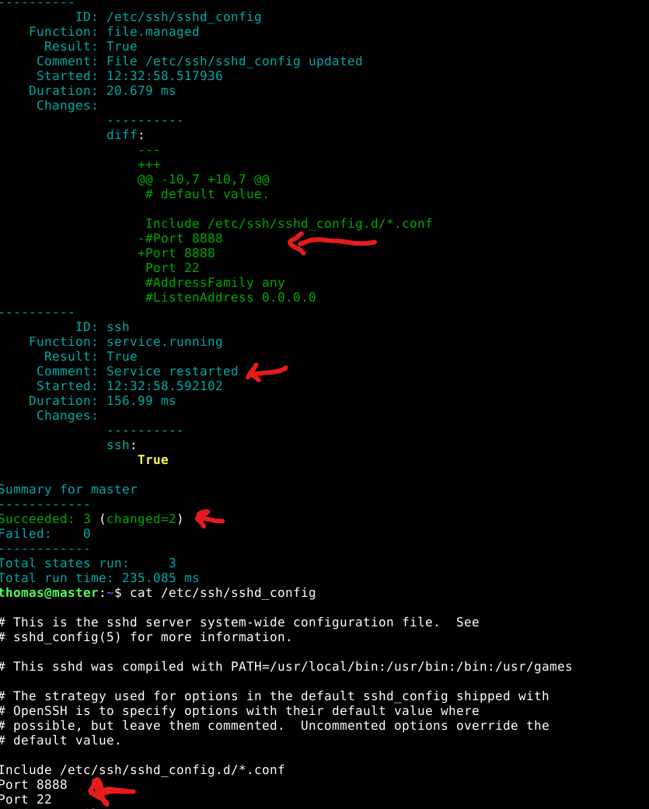  

Komento avasi taas portin 8888 ja potkaisi demonia onnistuneesti.  

## Apache

Lähtötilanne:  

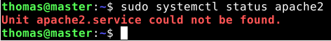  

### Käsintehty

1. `sudo apt-get update`
2. `sudo apt-get install apache2`
3. `mkdir -p /home/thomas/public-sites/punnala.example.com`
4. `micro hosts` ->
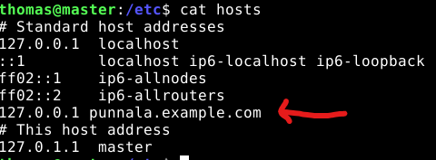
5. `cd /home/thomas/public-sites/punnala.example.com`
6. `micro index.html` ->
```
<!doctype html>
<html>
<head>
	<title>Punnala Test Page</title>
	<meta charset="utf-8" />
</head>
<body>
	<h1>Punnala Test Page</h1>
	<p>Let's test UTF-8 with "päivää"</p>
</body>
</html>
```
7. `cd /etc/apache2/sites-available/`
8. `micro punnala.example.com.conf` ->
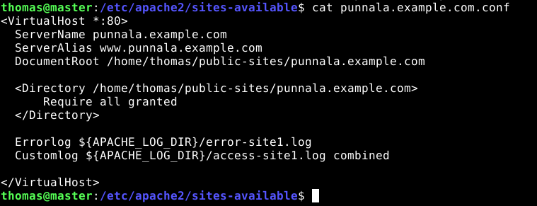
9. `sudo a2ensite punnala.example.com.conf`
10. `sudo systemctl reload apache2`
11. `curl localhost` ->
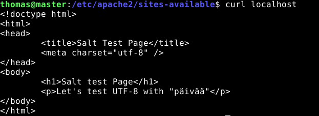

Siinä on asennettuna apache2 web-server ja name based virtual host konfiguroituna (punnala.example.com). Weppisivua pystyy muokkaamaan ilman sudoa ja se sijaitsee käyttäjän Thomas kotihakemistossa. `curl localhost`:illa tarkistettu, että sivu näkyy palvelimen etusivulla.  

Ennen kaiken poistamista tehdään /srv/salt/ -polkuun uusi kansio ja laitetaan konfiguraatiotiedostot talteen automatisointia varten.  

`cd srv/salt/` -> `sudo mkdir apache_demo2` -> `sudo cp /etc/apache2/sites-available/punnala.example.com.conf .` -> `sudo cp /home/thomas/public-sites/punnala.example.com/index.html .`  

  

  

Apache2 ja äsken konfatut tiedostot poistettu.  

### Automatisointi

`sudoedit /srv/salt/apache_demo2/init.sls`:  

```
apache2:
  pkg.installed

/home/thomas/public-sites/punnala.example.com:
  file.directory:
    - user: thomas
    - group: thomas
    - mode: '0755'

/home/thomas/public-sites/punnala.example.com/index.html:
  file.managed:
    - source: salt://apache_demo2/index.html
    - user: thomas
    - group: thomas
    - mode: '0644' 

/etc/apache2/sites-available/punnala.example.com.conf:
  file.managed:
    - source: salt://apache_demo2/punnala.example.com.conf

/etc/apache2/sites-enabled/punnala.example.com.conf:
  file.symlink:
    - target: /etc/apache2/sites-available/punnala.example.com.conf
    - require:
      - file: /etc/apache2/sites-available/punnala.example.com.conf

disable-default-site:
  cmd.run:
    - name: a2dissite -q 000-default.conf || true

add_site_to_hosts:
  host.present:
    - ip: 127.0.0.1
    - names:
      - punnala.example.com

apache2-service:
  service.running:
    - name: apache2
    - enable: True
    - reload: True
    - watch:
      - file: /etc/apache2/sites-available/punnala.example.com.conf
      - file: /etc/apache2/sites-enabled/punnala.example.com.conf
      - file: /home/thomas/public-sites/punnala.example.com/index.html
```

Ja sitten kokeillaan! `sudo salt '*' state.apply apache_demo2`.  

### Testaus

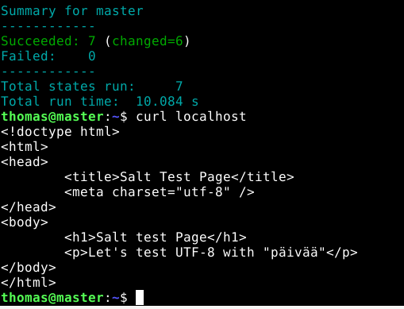  

Lupaavasti alkoi, eli ei erroreita ja weppiserverin etusivu on halutun näköinen. Kokeilin aluksi muokata etusivun index.html -tiedostoa ja huomasin, että sivun muokkaaminen vaati sudoa, joten muokkasin init.sls -tiedostoon omistajaksi käyttäjän thomas.  

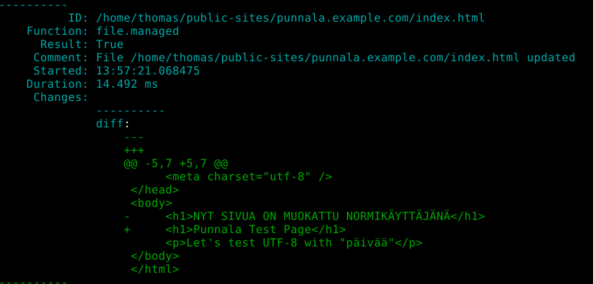  

Uusi ongelma ilmeni, eli apache ei pysty lukemaan tiedostoa tai hakemistoa.  

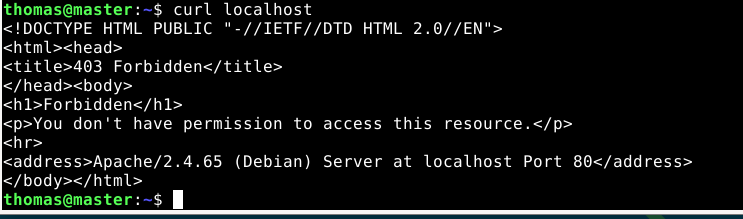  

Ongelma oli /home/thomas/ -kansion oikeuksissa. Kävin muokkaamassa tämän salt-tiedostoon ja uuden ajon jälkeen localhost näyttää vihdoinkin oikean sivun!  

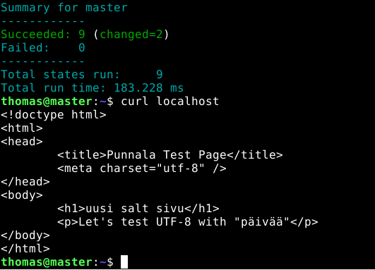  

Kävin vielä kokeilemassa ottaa punnala.example.com pois sites-enabled:ista ja ajamalla uudestaa state.apply apache_demo2, sain sen takaisin sites-enabled. 

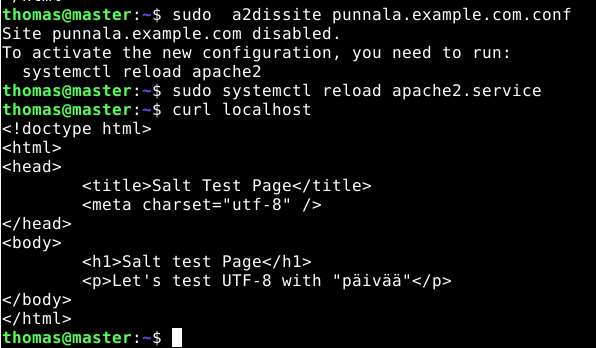  

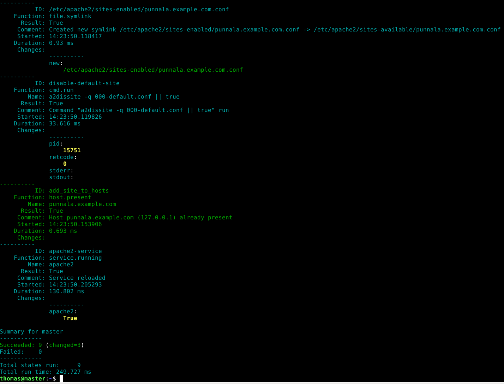  

Viimeisin versio apache_demo2:  
```
apache2:
  pkg.installed

/home/thomas:
  file.directory:
    - user: thomas
    - group: thomas
    - mode: '0751'

/home/thomas/public-sites/punnala.example.com:
  file.directory:
    - user: thomas
    - group: thomas
    - mode: '0755'

/home/thomas/public-sites/punnala.example.com/index.html:
  file.managed:
    - source: salt://apache_demo2/index.html
    - user: thomas
    - group: thomas
    - mode: '0644'

/etc/apache2/sites-available/punnala.example.com.conf:
  file.managed:
    - source: salt://apache_demo2/punnala.example.com.conf

/etc/apache2/sites-enabled/punnala.example.com.conf:
  file.symlink:
    - target: /etc/apache2/sites-available/punnala.example.com.conf
    - require:
      - file: /etc/apache2/sites-available/punnala.example.com.conf

disable-default-site:
  cmd.run:
    - name: a2dissite -q 000-default.conf || true

add_site_to_hosts:
  host.present:
    - ip: 127.0.0.1
    - names:
      - punnala.example.com

apache2-service:
  service.running:
    - name: apache2
    - enable: True
    - reload: True
    - watch:
      - file: /etc/apache2/sites-available/punnala.example.com.conf
      - file: /etc/apache2/sites-enabled/punnala.example.com.conf
      - file: /home/thomas/public-sites/punnala.example.com/index.html

```

## Postgresql

### Käsintehty

Aloitin PostgreSQL:n asennuksen komennoilla `sudo apt-get update` ja `sudo apt-get install postgresql postgresql-client` (Debian Wiki).

1. `sudo su - postgres`  #kirjaudutaan sisään postgressiin
2. `createuser --pwprompt mypguser` #luodaan postgreSql:n käyttäjä
3. annetaan salasana
4. `createdb -O mypguser mypgdatabase` #luodaan tietokanta
5. exit
6. `psql -h localhost -d mypgdatabase -U mypguser` #kirjaudutaan sisään tietokantaan
7. ja sisällä ollaan
8. `\q` #kirjautuu ulos tietokannasta  

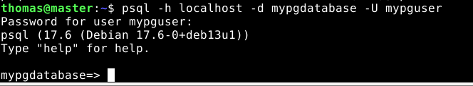  

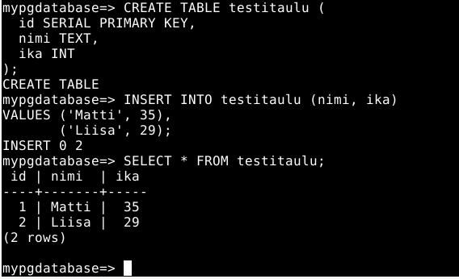  

Tietokannan testailua.  

### Automatisoitu

Aloitin automatisoinnin luomalla uuden kansion polkuun /srv/salt/ komennolla `sudo mkdir postgresql`. Siirryin kyseiseen kansioon käyttämällä cd komentoa. Loin sinne init.sls -tiedoston, mihin alan rakentamaan konfiguraatiota.  

Tämä asennustiedosto mukailee GoDjangon (2019) videolla näkyvää tiedostoa:  

```
postgresql:
  pkg.installed:
    - pkgs:
      - postgresql
      - postgresql-client

postgresql-service:
  service.running:
    - name: postgresql
    - enable: True

user:
  postgres_user.present:
    - name: myuser
    - password: password 
    - encrypted: True
    - superuser: False
    - runas: postgres

database:
  postgres_database.present:
    - owner: myuser
    - name: mydb
    - password: password
    - runas: postgres
```

Eli asennetaan postgresql ja postgresql-client -> varmistetaan, että se on päällä -> luodaan käyttäjä ja tietokanta. Seuraavaksi siirryin luomaan pilareita tätä tehtävää varten. Koska emme halua kovakoodata käyttäjä- ja tietokantatietoja salt-tiedostoon, voimme sijoittaa ne pilareihin, joista salt lukee kyseiset tiedot.  

Pilareiden avulla voidaan kohdistaa dataa vain tietylle minionille, esimerkiksi jos meidän tarvitsee luoda useita eri käyttäjiä, niin voimme tehdä jokaiselle minionille oman pilarin, jota yksi state-file käyttää.   

Aloitetaan luomalla kansio polkuun /srv/ -> mkdir /srv/pillar/. Tämä on default-polku, mistä salt lukee pilareita. Luodaan tuohon kansioon tiedosto nimeltä postgres.sls. Tuohon tiedostoon annettiin seuraavanlainen sisältö:  

```
postgresql:
  user: myuser
  password: password
  db_name: mydb
```
Tämän jälkeen siirryin takaisin /srv/salt/postgresql/init.sls -tiedostoon. Nyt lähdetään muokkaamaan sitä niin, että se lukee tiedot äsken luodusta pilarista.

```


postgresql:
  pkg.installed:
    - pkgs:
      - postgresql
      - postgresql-client

postgresql-service:
  service.running:
    - name: postgresql
    - enable: True

user:
  postgres_user.present:
    - name: {{ config['user'] }}
    - password: {{ config['password'] }}
    - encrypted: False
    - superuser: False
    - runas: postgres

database:
  postgres_database.present:
    - owner: {{ config['user'] }}
    - name: {{ config['db_name'] }}
    - runas: postgres
```
Tässä uusi init.sls -tiedosto salt-kansiossa. Nyt voidaan huomata, että nimien ja salasanojen tilalle on ilmestinyt Jinja-asetukset. Config sisältää pilarin datan, joka haetaan haluttuihin kohtiin.  

Seuraavaksi on aika kokeilla kuinka tämä toimii.  

Lähtötilanne:  

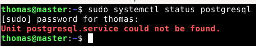  

Lähdin aluksi testaamaan lukeeko Salt pilarit oikein, eli komento `sudo salt-call --local pillar.items` ja tulos näytti tyhjää. Huomasin, että top.sls -tiedosto puuttui pillar -kansiosta, eli luodaan se sinne ja annetaan sisällöksi:  
```
base:
  '*':
    - postgresql
```

Tallennetaan ja kokeillaan uudestaan. Taas error, virhe näyttää olevan pilareiden tiedostonimissä, eli muutetaan pilareista löytyvä postgres.sls -> postgresql.sls.  

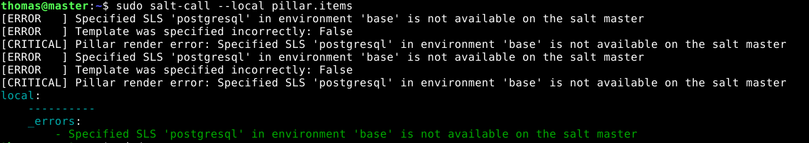  

Ja tiedostonimen muutoksen jälkeen toimii!  

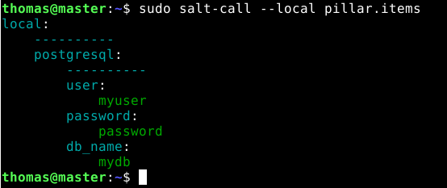  

Eli Salt pystyy lukemaan pilarit oikein.  

Ajetaan komento `sudo salt-call --local state.apply postgresql`

Postgresql:n asennus onnistui, mutta käyttäjää ja tietokantaa ei saatu vielä luotua. Alla saatu virheilmoitus, näköjään ei kannata käyttää liian vanhoja lähteitä, koska unencrypted pswd:s ei ole tuettuna enään.  

  

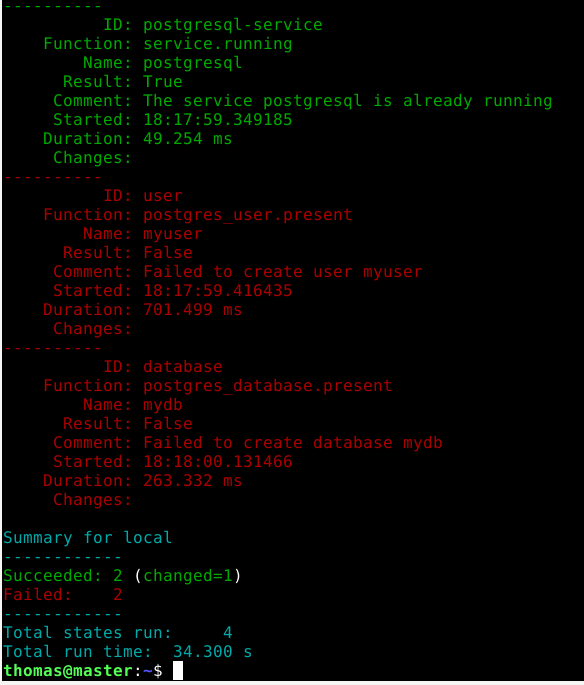  

Kävin aluksi poistamassa saltin init.sls -tiedoston user-kohdasta encrypted.  

Ja kuin ihmeen kaupalla se näytti korjaavan koko homman! Eli 4/4 succeed: user luotu ja database luotu.  

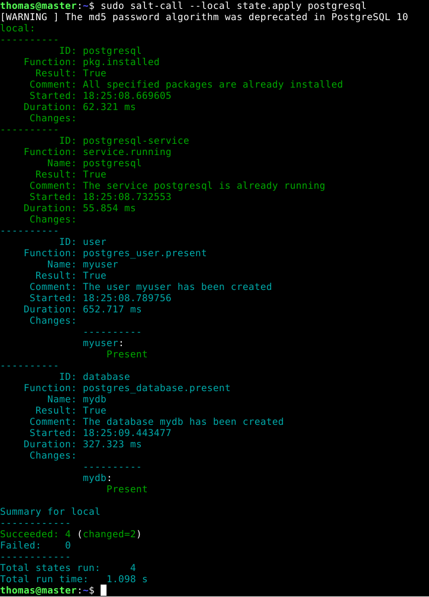  

Edelleen se valittaa the md5 passwordista, mutta ei välitetä siitä nyt.  

### Testaus

Tietokanta näkyy ja omistajana on määrittelemäni myuser.  

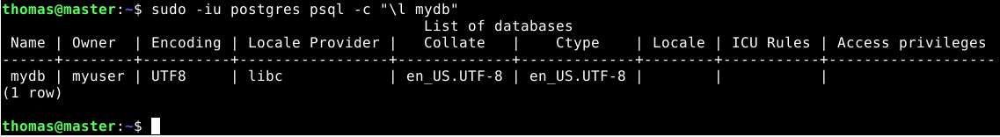  

Kokeillaan kirjautua seuraavaksi sisään tietokantaan. Annetaan komento `psql -h localhost -d mydb -U myuser`. Tämä yritys aiheuttaa errorin, eli en pääse käyttäjälle sisään vielä.  

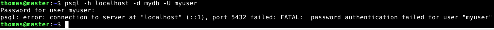  

Ongelma tuntuu olevan password algorithmissa. Minun täytyisi saada salasana 

# Lähteet

GoDjango. 2019. SaltStack and Pillar Basics. Katsottavissa: https://www.youtube.com/watch?v=lizzgnVOsR4&t=20s. Katsottu: 12.11.2025  

Heinonen, J. 2025. Apache2. Luettavissa: https://github.com/johannaheinonen/johanna-test-repo/blob/main/linux-03092025.md. Luettu: 11.11.2025  

Karvinen, T. 2025. Palvelinten hallinta. Luettavissa: https://terokarvinen.com/palvelinten-hallinta/#h4-pkg-file-service. Luettu: 11.11.2025  

Karvinen, T. 2018. Pkg-File-Service – Control Daemons with Salt – Change SSH Server Port. Luettavissa: https://terokarvinen.com/2018/04/03/pkg-file-service-control-daemons-with-salt-change-ssh-server-port/?fromSearch=karvinen%20salt%20ssh. Luettu: 11.11.2025  

Wiki.Debian. PosgreSql. Luettavissa: https://wiki.debian.org/PostgreSql. Luettu: 11.11.2025  

