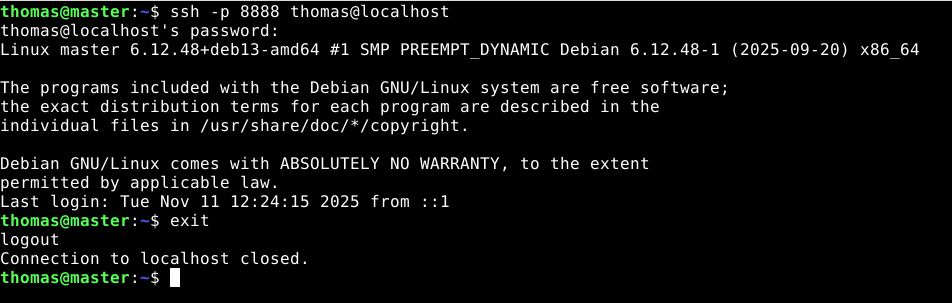

update: 22.11.2025  

# Lokaali tietokone ja käyttöjärjestelmä
**GPU:** Nvidia RTX 2070  
**Processor:** Intel Core i9-9900K 3.60 Ghz    
**RAM:** 16.0 GB  
**OS:**  Windows 11 Home  

# Virtuaali palvelin
**Template:** Debian GNU/Linux 13 (Trixie)  
**CPU:** 2 core  
**Storage:** 60 GB  

# Toimiva versio

## Tiivistelmä

Tämän raportin tavoitteet löytyvät Karvisen (2025) Palvelinten hallinta verkkosivulta kohdasta H5. 

## Lue ja tiivistä artikkelit

### What is Git?

Git on versionhallinta, joka tallentaa tiedostosi snapshotin. Aina kun tallennat tiedostosi, Git ottaa "kuvan" tiedostosi sen hetkisestä tilasta, jos et ole tehnyt muutoksia edelliseen versioon verrattuna Git ei tallenna tiedostoa uudestaan, se vain osoittaa edelliseen identtiseen tiedostoon. (Chacon & Straub 2014)  

Gitin hienous piilee siinä, että se toimii erittäin hyvin lokaalisti. Gitin ei tarvitse hakea versiohistoriaa palvelimelta vaan se lukee sen suoraan lokaalista tietokannastasi. Esimerkiksi voit työskennellä junassa tai lentokoneessa, jossa sinulla ei ole internetyhteyttä. Voit vain committaa muutokset lokaalisti ja kun saat internetyhteyden seuraavan kerran voit työntää ne esimerkiksi ulkoiseen repisetoryyn. (Chacon & Straub 2014)  

Git käyttää hash-tunnistetta viitatessaan tiedostoihin, jolloin se tarkistaa datan ennen tallennusta. Tämän vuoksi sisältöä ei pysty muuttamaan ilman, että Git tietäisi siitä. (Chacon & Straub 2014)  

Gitin kolme tilaa ovat:  

1. Modified, eli muuttunut paikallisesti
2. Staged, eli mitä on sisällytetty seuraavaan committiin
3. Committed, eli tiedosto / tiedostot tallennetaan Gitin tietokantaan
(Chacon & Straub 2014)

### add, commit, pull ja push (Github: GIT CHEAT SHEET)

1. Git add: lisää tiedosto seuraavaan committiin sellaisena kuin se on nyt (tätä kutsutaan stage vaiheeksi)
2. Git commit: lisää stage:ssa olevat tiedostot uudeksi commit snapshotiksi. Tähän lisätään kuvaava viesti muutoksista
3. Git pull: hae ja yhdistä kaikki uudet commit:it etärepositorysta
4. Git push: siirrä lokaalit commitit etärepositoryyn

### Varaston historia

Kirjauduin virtuaalikoneelleni ja kloonasin Karvisen Suolax-repositoryn (2024) ajamalla komennon `git clone git@github.com:terokarvinen/suolax.git`. Tämän jälkeen `git log --patch --color|less -R`.  

  

Viimeisin committi on nimetty: improve usage instuctions. Muutokset on tehty tiedostoon README.md. Käyttöohjeita muokattiin seuraavasti:  

1. Lisättiin piste lauseen perään.
2. Poistettiin ohje: To apply "Hello, world!" state
3. Uusi ohje: Run 'make' to apply all states.
4. Lisättiin linkki lisätietoon Saltista
5. Lisättiin ohje kuinka katsoa repositoryn historia

## Tehtävät

## Lähteet

Chacon & Straub, 2014. Getting Started - What is Git?. Luettavissa: https://git-scm.com/book/en/v2/Getting-Started-What-is-Git%3F. Luettu: 22.11.2025  

Github. GIT CHEAT SHEET. GithubEducation. Luettavissa: https://education.github.com/git-cheat-sheet-education.pdf. Luettu: 22.11.2025  

Karvinen, T. 2025. Palvelinten hallinta. Luettavissa: https://terokarvinen.com/palvelinten-hallinta/#h4-pkg-file-service. Luettu: 22.11.2025  

Karvinen, T. 2024. suolax. Github-repository. Luettavissa: https://github.com/terokarvinen/suolax/#. Luettu: 22.11.2025  

