update: 22.11.2025  

# Lokaali tietokone ja käyttöjärjestelmä
**GPU:** Nvidia RTX 2070  
**Processor:** Intel Core i9-9900K 3.60 Ghz    
**RAM:** 16.0 GB  
**OS:**  Windows 11 Home  

# Virtuaali palvelin
**Template:** Debian GNU/Linux 13 (Trixie)  
**CPU:** 2 core  
**Storage:** 60 GB  

# Toimiva versio

## Tiivistelmä

Tämän raportin tavoitteet löytyvät Karvisen (2025) Palvelinten hallinta verkkosivulta kohdasta H5. Tässä raportissa tutustutaan Gitin käyttöön ja sen yleisimpiin komentoihin, kuten add, commit, push, pull ja clone. Aikaa raportin ja tehtävien tekemiseen meni noin kaksi tuntia.  

## Lue ja tiivistä artikkelit

### What is Git?

Git on versionhallinta, joka tallentaa tiedostosi snapshotin. Aina kun tallennat tiedostosi, Git ottaa "kuvan" tiedostosi sen hetkisestä tilasta, jos et ole tehnyt muutoksia edelliseen versioon verrattuna Git ei tallenna tiedostoa uudestaan, se vain osoittaa edelliseen identtiseen tiedostoon. (Chacon & Straub 2014)  

Gitin hienous piilee siinä, että se toimii erittäin hyvin lokaalisti. Gitin ei tarvitse hakea versiohistoriaa palvelimelta vaan se lukee sen suoraan lokaalista tietokannastasi. Esimerkiksi voit työskennellä junassa tai lentokoneessa, jossa sinulla ei ole internetyhteyttä. Voit vain committaa muutokset lokaalisti ja kun saat internetyhteyden seuraavan kerran voit työntää ne esimerkiksi ulkoiseen repisetoryyn. (Chacon & Straub 2014)  

Git käyttää hash-tunnistetta viitatessaan tiedostoihin, jolloin se tarkistaa datan ennen tallennusta. Tämän vuoksi sisältöä ei pysty muuttamaan ilman, että Git tietäisi siitä. (Chacon & Straub 2014)  

Gitin kolme tilaa ovat:  

1. Modified, eli muuttunut paikallisesti
2. Staged, eli mitä on sisällytetty seuraavaan committiin
3. Committed, eli tiedosto / tiedostot tallennetaan Gitin tietokantaan
(Chacon & Straub 2014)

### add, commit, pull ja push (Github: GIT CHEAT SHEET)

1. Git add: lisää tiedosto seuraavaan committiin sellaisena kuin se on nyt (tätä kutsutaan stage vaiheeksi)
2. Git commit: lisää stage:ssa olevat tiedostot uudeksi commit snapshotiksi. Tähän lisätään kuvaava viesti muutoksista
3. Git pull: hae ja yhdistä kaikki uudet commit:it etärepositorysta
4. Git push: siirrä lokaalit commitit etärepositoryyn


### Varaston historia

Kirjauduin virtuaalikoneelleni ja kloonasin Karvisen Suolax-repositoryn (2024) ajamalla komennon `git clone git@github.com:terokarvinen/suolax.git`. Tämän jälkeen `git log --patch --color|less -R`.  

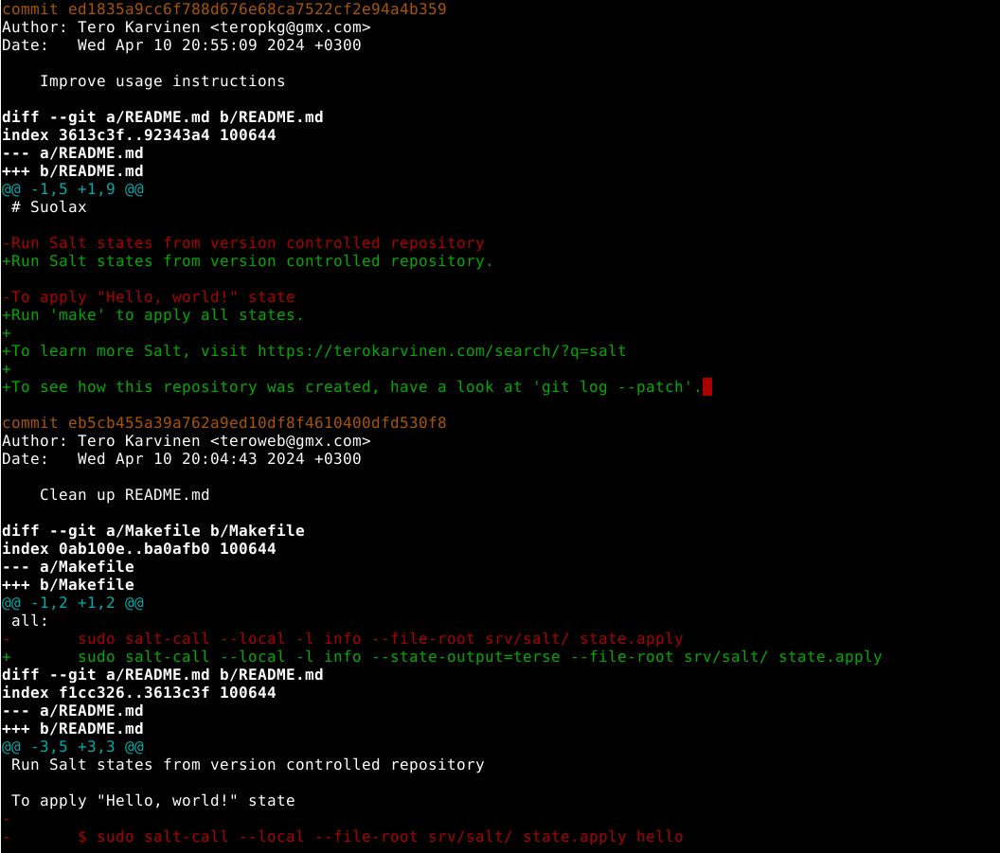  

Viimeisin committi on nimetty: improve usage instuctions. Muutokset on tehty tiedostoon README.md. Käyttöohjeita muokattiin seuraavasti:  

1. Lisättiin piste lauseen perään.
2. Poistettiin ohje: To apply "Hello, world!" state
3. Uusi ohje: Run 'make' to apply all states.
4. Lisättiin linkki lisätietoon Saltista
5. Lisättiin ohje kuinka katsoa repositoryn historia

## Tehtävät

### Online

Lähdettiin luomaan uutta repositorya Githubiin. Alla olevassa kuvassa on repon asetukset. Tärkeimmät ovat: nimessä Snow ja licence on GNU General Public Licence 3.  

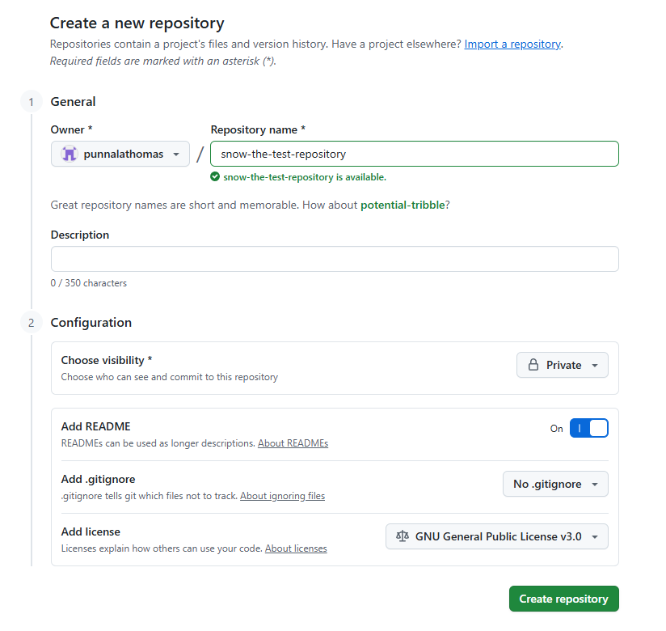  

Readme-tiedostoon lisätty jälkeenpäin teksti: "There is snow outside.".  

### Dolly

Kloonataan äsken luotu varasto virtuaalikoneelle. Aloitetaan käyttäjän kotihakemistosta ja ajetaan komento `git clone git@github.com:punnalathomas/snow-the-test-repository.git`. Tässä käytettiin SSH-yhteyttä, jolloin voimme puskea muutokset etärepoon virtuaalikoneesta.  

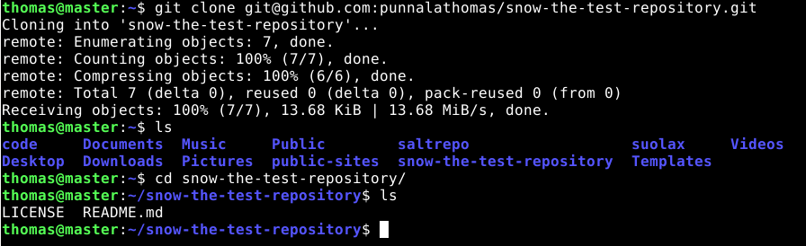  

Seuraavaksi lähdetään tekemään lokaalisti muutoksia repositoryyn. Luodaan Hello World tiedosto komennolla `micro helloworld.md` ja annetaan sisällöksi "Hello World".  

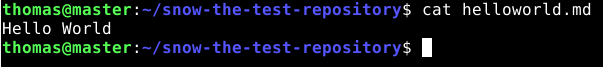  

Etärepositoryn lähtötilanne:  

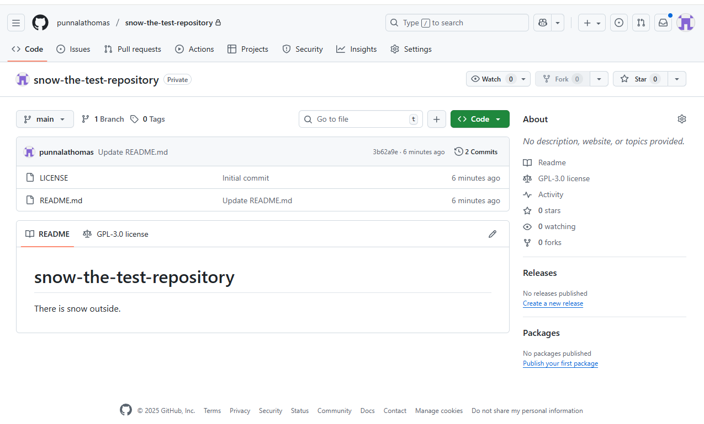  

Lähdetään puskemaan muutokset etärepoon lokaalilta koneelta. Annetaan komennot:  

1. `git add .`
2. `git commit -m add helloworld.md (commit viesti olisi pitänyt kirjoittaa lainausmerkkeihin "")
3. `git push`

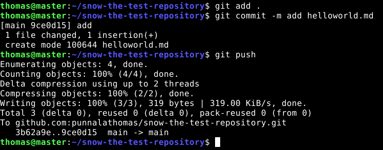  

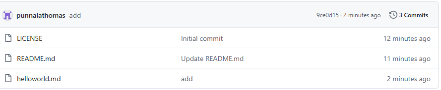  

### Doh!

Tehdään hölmö muutos ja peruutetaan se komennolla `git reset --hard`.  

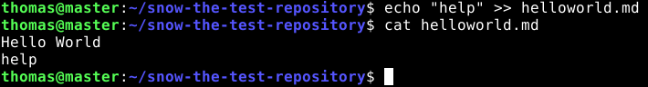  

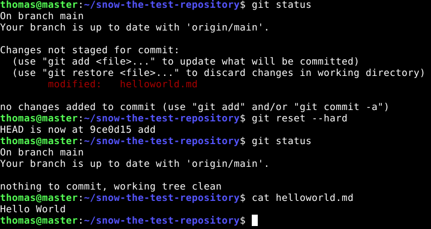  

### Tukki

Tutkitaan repositoryn lokia komennolla `git log --patch`.  

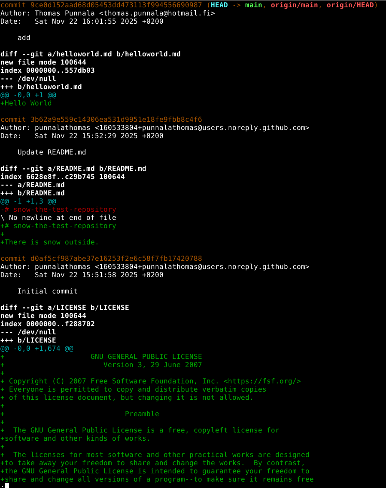  

Nimi ja sähköposti näkyvät oikein.  

Alimpana näkyy initail commit, joka sisältää lisenssin ja README-tiedoston lisäyksen.  

Seuraava commit on README:n päivitys, eli lisäsin tekstiä siihen.  

Uusin commit näyttää helloworld.md -tiedoston luonnin ja sen sisällön.  

Lokista voidaan myös huomata, että commit:ien nimet ovat hash-tunnisteita. Jokaisessa commitissa näkyy myös kyseisen muutoksen tekijän nimi ja sähköpostiosoite, sekä päivämäärä ja aika.  

### Suolattu rakki

Aloitetaan luomalla aikaisemmin luotuun repositoryyn kansiot srv ja salt, eli `mkdir -p srv/salt`.  

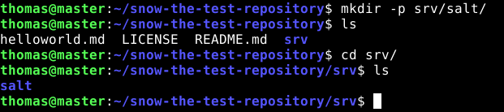  

Siirrytään kansioon salt ja luodaan top.sls -tiedosto sinne. Annetaan sisällöksi:  

```
base:
  '*':
    - test.test
```  

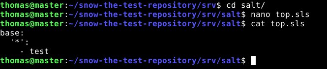  
Huom kuvassa näkyy nimenä vain "-test", tämä on jälkeenpäin muutettu muotoon "-test.test".  

Tämän jälkeen salt-kansion sisällö test-kansio ja sinne test.sls -tiedosto, jonka sisältö on seuraavanlainen:  

```
hello:
  cmd.run:
    - name: echo "Hello World"
```
Seuraavaksi kokeillaan ajaa repon juuresta Salt-komentoa. `sudo salt-call --local --file-root ./srv/salt state.apply`. Voimme myös käyttää absoluuttista polkua mistä tahansa, eli `sudo salt-call --local --file-root /home/thomas/snow-the-test-repository/srv/salt state.apply`.  

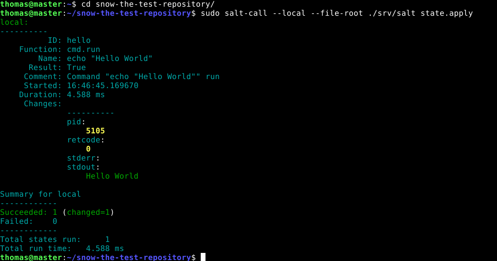  

Seuraavaksi ajetaan muutokset etärepoon komennoilla:  

1. git add .
2. git commit -m "add top.sls and test.sls"
3. git pull
4. git push

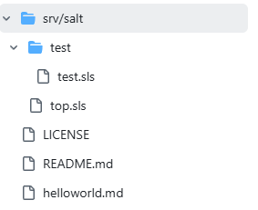  

### Pari projektiin

Pari löydetty: [nlholm](https://github.com/nlholm)  

### Collaboration

Projektiparini Niina oli jo luonut testi repon meille ja kävin hyväksymässä kutsun Githubin kautta. Nyt testaan voinko tehdä muutoksia koneeltani sinne.  

1. cd
2. git clone git@github.com:nlholm/linux-test.git
3. cd linux-test/
4. ls
5. nano moro.md
6. git add .
7. git commit -m "add moro.md"
8. git pull
9. git push

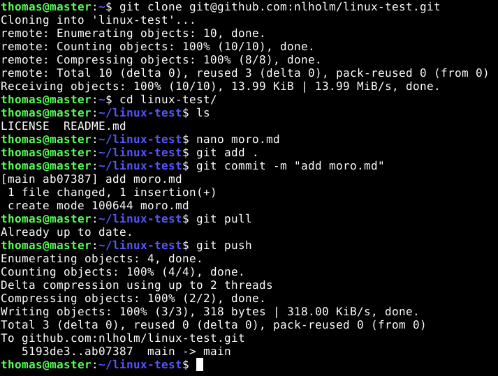  

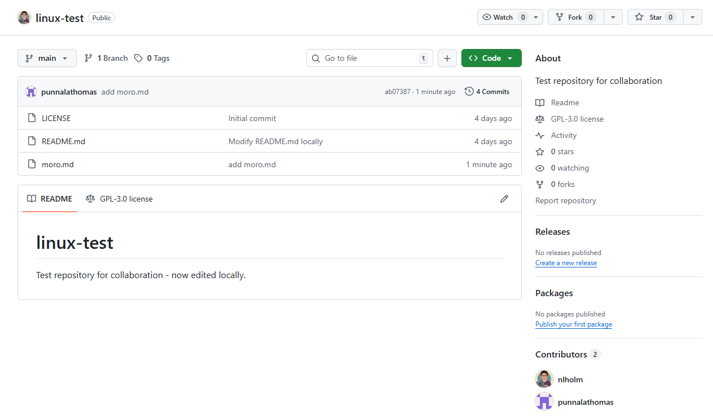  


## Lähteet

Chacon & Straub, 2014. Getting Started - What is Git?. Luettavissa: https://git-scm.com/book/en/v2/Getting-Started-What-is-Git%3F. Luettu: 22.11.2025  

Github. GIT CHEAT SHEET. GithubEducation. Luettavissa: https://education.github.com/git-cheat-sheet-education.pdf. Luettu: 22.11.2025  

Karvinen, T. 2025. Palvelinten hallinta. Luettavissa: https://terokarvinen.com/palvelinten-hallinta/#h4-pkg-file-service. Luettu: 22.11.2025  

Karvinen, T. 2024. suolax. Github-repository. Luettavissa: https://github.com/terokarvinen/suolax/#. Luettu: 22.11.2025  


